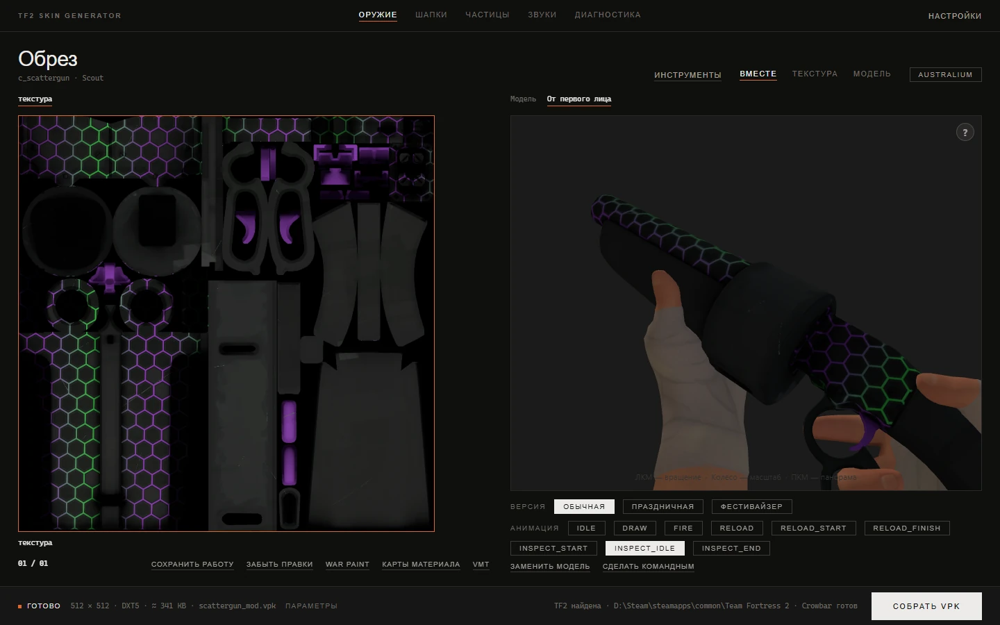

# TF2 Skin Generator

**Язык:** [English](README.md) · Русский

TF2 Skin Generator помогает делать моды для Team Fortress 2 без возни с консольными утилитами. Вы выбираете оружие, шапку или эффект прямо из игры, кладёте на него свою картинку, смотрите результат в 3D и собираете файл `.vpk` для папки `tf/custom`.

Всю рутину приложение берёт на себя. Оно находит модель и текстуры в файлах игры, разбирает модель через Crowbar, переводит картинки в VTF, пишет материалы VMT, собирает модель обратно игровым `studiomdl` и упаковывает всё в VPK.



## Что можно сделать

| Задача | Где в приложении | Гайд |
|---|---|---|
| Перекрасить оружие, снаряд, аптечку или патроны, реквизит насмешки | **Оружие** | [Первый скин](docs/ru/reskin.md) |
| Перекрасить шапку или другую косметику, включая её стили | **Шапки** | [Косметика](docs/ru/cosmetics.md) |
| Покрасить отдельный кусок модели: прицел, рукоять, логотип на прикладе | **Разделить на части** | [Покраска по частям](docs/ru/model-parts.md) |
| Запечь игровой War Paint в текстуру и дорисовать поверх | **War Paint** | [War Paint](docs/ru/war-paint.md) |
| Добавить свечение, блеск, отражения, прозрачность или рельеф | **Карты материала**, **VMT**, опции сборки | [Материалы и эффекты](docs/ru/materials.md) |
| Заменить модель оружия своей: SMD, OBJ или GLB | **Заменить модель** | [Своя модель](docs/ru/custom-models.md) |
| Перекрасить тела и руки классов, маски Шпиона, надпись крита, спрей, эффекты смерти, небо | **Оружие**, список категорий | [Персонажи, эффекты и небо](docs/ru/special-items.md) |
| Изменить эффект частиц, в том числе анюжуал | **Частицы** | [Редактор частиц](docs/ru/particles.md) |
| Заменить звуки оружия, реплики и звуки мира | **Звуки** | [Звуки](docs/ru/sounds.md) |
| Понять, почему мод не появился в игре | **Диагностика** | [Установка модов и решение проблем](docs/ru/troubleshooting.md) |

## Что нужно

- 64-битная Windows 10 или 11.
- Team Fortress 2, установленная через Steam. Приложение читает архивы игры и вызывает `studiomdl.exe` и `vpk.exe` из её папки `bin`, поэтому без игры собрать ничего не получится.
- Microsoft Edge WebView2 Runtime: интерфейс рисуется через него. В Windows 11 он есть сразу, а в Windows 10 обычно приходит с обновлениями Windows или Office. Если окно приложения остаётся пустым, загляните в [решение проблем](docs/ru/troubleshooting.md#окно-приложения-пустое-или-не-открывается).

## Установка

Скачайте последний релиз со [страницы Releases](https://github.com/xietyBTW/Tf2SkinGenerator/releases/latest). В нём два файла:

| Файл | Что это |
|---|---|
| `Tf2SkinGenerator-Setup.exe` | Установщик. Прав администратора не просит и ставит программу для текущего пользователя, по умолчанию в `%LOCALAPPDATA%\Programs\Tf2SkinGenerator`. |
| `Tf2SkinGenerator-portable.zip` | То же приложение обычной папкой. Распакуйте в любое место, куда у вас есть права на запись, и запустите `Tf2SkinGenerator.exe`. |

Обе версии обновляются из самого приложения: **Настройки → Проверить обновления**. Ваши работы, открытые моды, настройки и папка экспорта хранятся отдельно от программы, в `%LOCALAPPDATA%\Tf2SkinGenerator`, поэтому обновление и переустановка их не трогают. Портативной версии это тоже касается.

## Первый запуск

1. Приложение ищет TF2 по записям Steam в реестре и по списку его библиотек, включая библиотеки на других дисках. Если игра нашлась, оно покажет путь и предложит его сохранить. Если нет, вставьте путь к папке, в которой лежат `tf` и `bin`, например `D:\Steam\steamapps\common\Team Fortress 2`.
2. Поверх интерфейса запустится короткое обучение: оно проводит через один скин от начала до конца. Его можно пропустить и пройти позже: **Настройки → Пройти обучение заново**.
3. По умолчанию интерфейс на английском. Русский включается в **Settings → Application language**.

## Скин за пять шагов

1. Нажмите **Выберите предмет** вверху, оставьте категорию **Оружие** и выберите оружие. В длинных списках помогают фильтры **Класс** и **Тип** и строка поиска.
2. Подождите, пока загрузится модель. В первый раз это несколько секунд: приложение разбирает её. Дальше она берётся из кэша.
3. Перетащите свою картинку на карточку текстуры слева. Двойной щелчок по карточке открывает выбор файла.
4. Покрутите модель левой кнопкой мыши и посмотрите, как получилось. Вкладка **От первого лица** показывает оружие в руках, с анимациями.
5. Нажмите **Собрать VPK** справа внизу. Готовый файл появится в папке экспорта: **Инструменты → Открыть папку экспорта**.

Скопируйте `.vpk` в `...\Team Fortress 2\tf\custom\` и перезапустите игру. Всё. В гайде [«Первый скин»](docs/ru/reskin.md) тот же путь разобран подробно: командные цвета, настройки сборки и вопросы, которые приложение может задать во время сборки.

## Документация

Все гайды собраны в [`docs/`](docs/README.md).

**С чего начать**
- [Первый скин](docs/ru/reskin.md): весь путь от выбора оружия до проверки в игре
- [Обзор интерфейса](docs/ru/usage.md): каждая панель, кнопка и сочетание клавиш

**По темам**
- [Косметика](docs/ru/cosmetics.md)
- [Покраска по частям](docs/ru/model-parts.md)
- [War Paint](docs/ru/war-paint.md)
- [Материалы и эффекты](docs/ru/materials.md)
- [Своя модель](docs/ru/custom-models.md)
- [Персонажи, эффекты и небо](docs/ru/special-items.md)
- [Редактор частиц](docs/ru/particles.md)
- [Звуки](docs/ru/sounds.md)
- [Работы, черновики и библиотека модов](docs/ru/works-and-mods.md)

**Справка**
- [Настройки и папки с данными](docs/ru/settings.md)
- [Установка модов и решение проблем](docs/ru/troubleshooting.md)
- [Сборка из исходников](docs/ru/building-from-source.md)

## Казуал и sv_pure

Казуальные серверы Valve работают с `sv_pure`, и игра там не загружает большую часть пользовательских файлов. Для скинов, которые лежат на модели (оружие, косметика, тела и руки классов, снаряды, аптечки, реквизит насмешек), приложение использует известный обходной путь: переносит материалы модели в папку, которую `sv_pure` пропускает. Небо, звуки, частицы, маски маскировки Шпиона, а также скины крита, спрея и эффектов смерти этим путём не идут. Подробности и оговорки в разделе [решения проблем](docs/ru/troubleshooting.md#казуал-и-sv_pure).

## Запуск из исходников

```bat
python -m venv .venv
.venv\Scripts\python -m pip install -r requirements.txt
.venv\Scripts\python main.py
```

Нужен Python 3.12 или новее. Настройка окружения, устройство проекта, тесты и выпуск релиза описаны в гайде [«Сборка из исходников»](docs/ru/building-from-source.md).

## Лицензия

Исходный код распространяется по [лицензии MIT](LICENSE). Crowbar, инструменты VTFLib (VTFCmd, VTFLib, HLLib, DevIL), meshoptimizer и three.js идут в комплекте под своими лицензиями, их список в [THIRD_PARTY_LICENSES.md](THIRD_PARTY_LICENSES.md).

TF2 Skin Generator сделан фанатом игры. Он не связан с Valve и не одобрен ею. Team Fortress 2 и её ресурсы принадлежат Valve Corporation, файлы игры вместе с приложением не распространяются.
