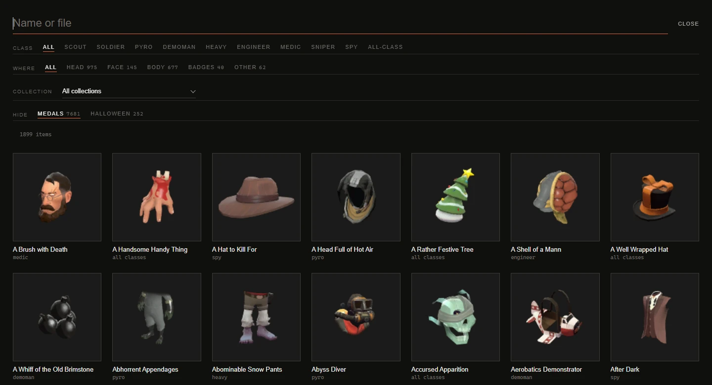
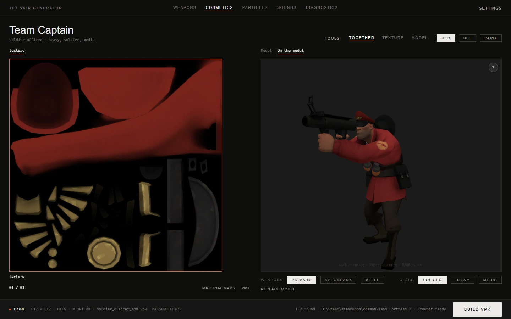

# Cosmetics

[Documentation](../README.md) · [Русская версия](../ru/cosmetics.md)

The **Cosmetics** section covers hats, misc items and medals. Painting a cosmetic works the same way as painting a weapon (see [Your first skin](reskin.md)), so this page is about what's different: finding the item among thousands, team colors that live in the material rather than the texture, model styles, and choosing which classes get the mod.

## Finding a cosmetic

Open **Cosmetics** in the header and click the item name to bring up the catalog. The list comes straight from the game's `items_game.txt`, so new cosmetics show up as soon as the game gets them.

**Search** is the fastest way in. Results are ranked: a full name match comes first, then names that start with your text, then names where a word starts with it, then everything else that contains it. With the Russian interface the search also matches English names, so `Team Captain` finds the item even when the list shows its Russian title. If nothing is found, the app suggests similar names under the empty list; clicking one runs the search again.

**Filters** narrow the list. The **Where** buttons and the **Collection** list show how many items each choice leaves, and those numbers follow your search and the other filters. The **Hide** buttons show how many items each of them hides in total.

| Filter | What it does |
|---|---|
| **Class** | Items that this class can wear. Items for all classes stay in every class. |
| **Where** | Where the item is worn: **Head**, **Face**, **Body**, **Badges**, **Other**. The groups are built from the game's equip regions. |
| **Collection** | The game's collections (cases and seasonal releases), newest first, with the number of items in each. |
| **Hide** | **Medals** hides tournament and community medals, more than seven thousand of them. **Halloween** hides cosmetics that the game only shows during Halloween and on full moons. Your choice is remembered. |

Each card shows the item's backpack icon and who can wear it: one class name, the number of classes, or "all classes". A mark like "3 styles" means the item has model styles with different geometry.

## Painting it

Pick the cosmetic, wait for the model, and drop your image on its card. Everything from the weapon guide applies here: [painting by parts](model-parts.md), [material maps and the VMT editor](materials.md), per-texture settings, undo with <kbd>Ctrl</kbd>+<kbd>Z</kbd>.

A cosmetic made for several classes usually has a separate model for each of them. The preview loads the first class's model. The models often share one texture, and then you paint it once for all of them.

## Team colors and game paints

About two thirds of the game's cosmetics don't keep their team colors in the texture. The color comes from the material (VMT), and the alpha channel of the texture works as a mask: where the alpha is white, the game applies the team color or the paint from the player's inventory. That's why the painted areas of such textures look almost black in the files: their color gets replaced in game anyway.

The app takes this into account in three places.

**RED and BLU in the preview.** The team buttons appear when the teams really differ. For some items the texture is the same and only the color in the material changes; the preview still shows the difference, because it applies the material's colors.

**The Game paints option** in the build settings is on by default. With it, the mod keeps the material's color parameters, so your cosmetic gets team colors and inventory paints exactly like a stock one, through your texture's alpha. If you turn it off, the item looks the way you drew it for both teams, and inventory paint has no effect on it.

**The paint question during the build.** If the material is painted by the alpha mask and your image has no alpha channel, the whole item would turn into one color in game, even though the preview shows your picture. The build stops and asks what to do:

| Answer | Result |
|---|---|
| **As in the image** | The game won't paint the item. It looks like the preview. |
| **Remove paint from the VMT** | Same look, and the paint parameters are also removed from the material. |
| **Paint like the game** | The color goes only where the game puts it on the original: the app takes the alpha mask from the game texture. |
| **Build as is** | The whole item gets painted. |

To control exactly where the paint goes, draw the mask yourself: save your image with an alpha channel that is white where the color should go and black elsewhere, and pick a format with alpha (`DXT5`).

### Previewing game paints

The **Paint** button next to the team buttons opens the list of the game's 29 paints. Picking one repaints the preview, the cards and the model. Team paints show their RED or BLU color depending on the active team, and a colored dot on the button reminds you a paint is on. **No paint** returns the unpainted look.

The paint is only a preview and doesn't go into the mod. The game blends the color by multiplying it with the texture, so a painted item looks a bit muted. The preview does the same, and that's how it will look in game.

## Styles

Cosmetics can have two kinds of styles.

**Model styles** change the geometry: a hat with and without a feather, a mask in two shapes. They appear in the **Cosmetic style** row under the model. Choosing one loads that style's model. Edits are kept per style, and a dot next to a style name marks the styles you changed. All edited styles go into the same mod, so you don't need to build them one by one.

**Texture styles** keep the geometry and swap textures. They appear in the **Style** row, the same as on weapons, with **Default** for the base look. A texture style inherits the base textures until you tell it otherwise: the album shows only the materials the style changes, and **Add material** under the album adds one more material to it. The **×** on such a card removes the material from the style again.

Sometimes two styles use the same material. In game they can't look different then, so the build puts one texture into the mod and warns you about it.

## Looking at it on a character

The **On the model** scene puts the cosmetic on a class standing in the game's pose for the chosen weapon slot:

- **Class** picks who wears it, when several classes can.
- **Weapons** picks the slot: **Primary**, **Secondary**, **Melee**, plus **Sapper** and **PDA** for the classes that have them. The class holds the stock weapon of that slot, and the pose changes with it.

This is the quickest way to check that a texture sits right on the head, and how the item looks next to the class's own colors.

## Choosing classes when building

When the cosmetic has separate models for several classes, **Build VPK** first asks **Which classes to build the hat for**. Each class has its own model, so a mod for all nine classes carries nine models. Click the class tiles you need (**All** and **None** help with long lists), and only those classes go into the mod. **Build** stays disabled until at least one class is ticked. The next build of a multi-class cosmetic in this session starts from your last choice.

## See also

- [Your first skin](reskin.md): the general flow of painting and building.
- [Painting by parts](model-parts.md): color separate pieces of a hat.
- [Materials and effects](materials.md): the VMT editor has a ready **In-game paint** block for materials that should take paint.
