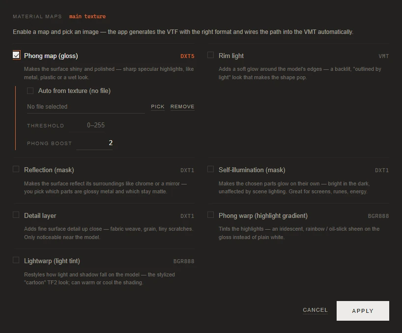
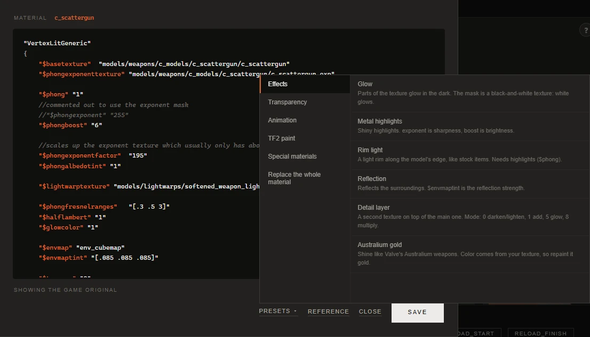

# Materials and effects

[Documentation](../README.md) · [Русская версия](../ru/materials.md)

A texture sets the colors of a model. How those colors react to light is decided by the material, the VMT file next to the texture. Gloss, glow in the dark, chrome reflections, transparency and animated textures all live there. The app gives you three ways to work with materials, from the simplest to the most flexible:

1. **Material maps**: pick an effect and an image, and the app generates the extra texture and wires it into the VMT.
2. **Normal Map** in the build options: surface relief built from your texture's brightness.
3. **The VMT editor**: the material as text, with ready blocks for common effects and a reference of parameters.

All three are available for items with a model: weapons, cosmetics, class bodies and hands, projectiles, pickups and taunt props. They apply to the material whose card is selected in the album.

## Material maps

**Material maps** under the album opens a list of the extra maps a material can have. The name of the current material is shown next to the window's title. Turn a map on with its checkbox, give it an image, and press **Apply**. The app converts the image to a VTF in the format that map needs (shown on the right of its title) and adds the right lines to the VMT during the build. You don't need to know the paths or the parameter names.

| Map | What it gives | Auto from texture |
|---|---|---|
| **Phong map (gloss)** | Sharp specular highlights, like on metal, plastic or something wet. **Phong boost** sets how bright they are. | yes |
| **Rim light** | A soft glow along the edges of the model, as if lit from behind. It needs no image: **Sharpness** and **Strength** are all it takes. | no image needed |
| **Reflection (mask)** | Chrome-like reflections of the surroundings. The mask decides which areas are glossy metal and which stay matte. | yes |
| **Self-illumination (mask)** | Chosen areas glow on their own and stay bright in the dark. Good for screens, runes, energy. | yes |
| **Detail layer** | Fine detail visible up close: fabric weave, grain, small scratches. **Scale** sets how many times the detail repeats, **Blend** how it mixes with the base, **Factor** how strong it is. | no |
| **Phong warp (highlight gradient)** | Tints the highlights, for example into an oil-slick rainbow instead of plain white. | no |
| **Lightwarp (light tint)** | Changes how light and shadow fall on the model, the stylized look TF2 is known for. Can make the shading warmer or colder. | no |

**Auto from texture (no file)** builds the map from the brightness of the base texture, so you don't have to draw a mask: lighter areas shine or glow more. Leave **Threshold** empty for a smooth mask, or enter a value from 0 to 255 to make it sharp: then only pixels at least that bright are affected. For the gloss map, auto mode also adds a normal map and world reflections, which gives a shiny metal look in one click.

To remove a map, untick it and press **Apply**. **Cancel** closes the window without changes. Each material keeps its own set of maps, and they are part of the item's work.

## Normal map

A normal map tells the game how light should fall on the surface, so flat paint gets depth: seams, rivets, scratches, fabric. The app builds one from the brightness of your texture: light areas come out raised, dark areas recessed.

Open **Parameters** and tick **Normal Map** in the **Options** column. The relief appears on the model right away, and the preview is built the same way as the texture that will go into the mod.

| Setting | What it does |
|---|---|
| **Relief strength** | How deep the relief is, from 0 to 300 percent. 100 is a moderate relief that suits most weapons. |
| **Invert** | Light becomes recessed and dark becomes raised. |
| **Replace the original relief** | Appears when the item already has a normal map in the game. By default your relief is laid on top of the game's one, and the game's alpha channel, which often holds the gloss mask, is kept. Tick this to drop the game's relief and use only yours. |

The normal map follows the per-texture settings, so different materials can have different strength. If the texture is a GIF, the relief is animated together with it.

Without your own image the relief is built from the game texture, so you can add depth to a stock look as well.

## The VMT editor

**VMT** under the album opens the material of the current card as text. If you saved an edit before, you see it; otherwise you see the original from the game.

The editor highlights the syntax, and hovering a `$parameter` shows what it does. <kbd>Ctrl</kbd>+<kbd>S</kbd> saves, <kbd>Esc</kbd> closes. The status line tells you whether there are unsaved changes and whether a custom VMT is in use.

| Button | What it does |
|---|---|
| **Presets ▾** | Ready blocks for common effects, grouped by purpose. See below. |
| **Reference** | A searchable list of material parameters by group. A click inserts the parameter at the cursor; if it's already in the material, the cursor jumps to it. |
| **As in the game** | Deletes your edit. The material goes back to the game's original. |
| **Close** | Closes the editor. |
| **Save** | Saves the edit. A VMT with broken syntax (an unclosed brace or quote, no shader name) isn't saved: in game such a material turns invisible, and the reason would be hard to find. |

### Presets

The presets are merged into the material you already have instead of replacing it. Values replace parameters with the same name, and proxies are added to the end of the existing `Proxies` block. The game reads only the first such block, and the order of proxies matters, so they always go there.

| Group | Presets |
|---|---|
| **Effects** | **Glow** (a black-and-white mask, white parts glow), **Metal highlights**, **Rim light**, **Reflection**, **Detail layer**, **Australium gold** (the shine of Valve's Australium weapons; repaint your texture gold to match) |
| **Transparency** | **Smooth transparency** (from the alpha channel), **Cut out by alpha** (hard edges, for grates and foliage), **Glow over background** (black is invisible, bright parts glow), **Visible from both sides** |
| **Animation** | **Frame animation** (plays the frames of a multi-frame texture), **Scrolling texture** (conveyors, energy streams) |
| **TF2 paint** | **In-game paint**: the item takes paint from the inventory where the texture's alpha is white |
| **Special materials** | **Ghost shell**: the weapon becomes a translucent glowing shell, with a choice of color and reflection. **Glass**: the middle or the whole weapon turns into glass that bends the world behind it, like the Spy's cloak, and keeps its texture. **Wireframe**: the model is drawn as a mesh of edges; the flag is rare, so check it in game. |
| **Replace the whole material** | **VertexLitGeneric (basic)**, **UnlitGeneric (unlit)**, **Chrome / mirror**. These replace the whole VMT, so the editor asks first. |

Presets with settings (**Ghost shell**, **Glass**) open a small form instead of inserting text right away. If the effect is already in the material, the form starts from its current values.

### Good to know

- **An edit belongs to the material name, not to one work.** Every item that uses the same material picks the edit up when you build it, until you press **As in the game**. **Discard edits** under the album doesn't touch VMT edits.
- **Your edit survives builds.** You can build several times without opening the editor again.
- **Changing `$basetexture` is respected.** If you point the material at another texture in the editor, the build keeps that path and doesn't replace it with your image.
- **On weapons and cosmetics a static `$color2` doesn't hold.** A proxy in the game's materials overwrites it every frame, and `$color` has no effect on models at all. To tint an item, use the **In-game paint** preset or paint the texture itself.
- The editor isn't available for sprays, the crit text, death effects, skyboxes and opened VPK mods. For these the app either writes the material itself or keeps the game's one on purpose: death effects, for example, rely on special game shaders that a custom VMT would break.

## Materials that take color from the VMT

Many weapons and about two thirds of cosmetics are painted by the material: wherever the texture's alpha channel is white, the game applies a color stored in the VMT. If your image has no alpha, the build warns you before the whole item turns one color in game and offers several ways out. The question and its answers are described in [Your first skin](reskin.md#7-build), and the cosmetics side of it in [Cosmetics](cosmetics.md#team-colors-and-game-paints).

## Service and hidden materials

Some materials are hidden from the album on purpose: eyes, teeth, tongues, über (invulnerability) overlays, zombie skins, sheen and fresnel overlays. They go into the mod with their game textures. **Other** under the album shows them as cards when you do want to replace one. While it's on, the model wears the card you stop at in the place that card takes in its skin: the über body on the body, the zombie head on the head.

An über or zombie variant of a class body has no image of yours unless you give it one, and the build asks about it. **Copy the main one** then takes the texture of the part the variant replaces: the body for the body, the head for the head, the BLU body for the BLU variant. If that part kept its game texture, or it's the eyes, the variant keeps its own game texture too: there is nothing of yours to copy.

You can hide more materials yourself in **Settings → Hidden materials**. See [Settings](settings.md#hidden-materials).

## See also

- [Your first skin](reskin.md): the basics of textures and building.
- [Painting by parts](model-parts.md): different colors on different pieces of one material, and [a material of its own](model-parts.md#own-material-for-a-part) for a piece that needs its own VMT.
- [Settings](settings.md): advanced VTF flags and hidden materials.
