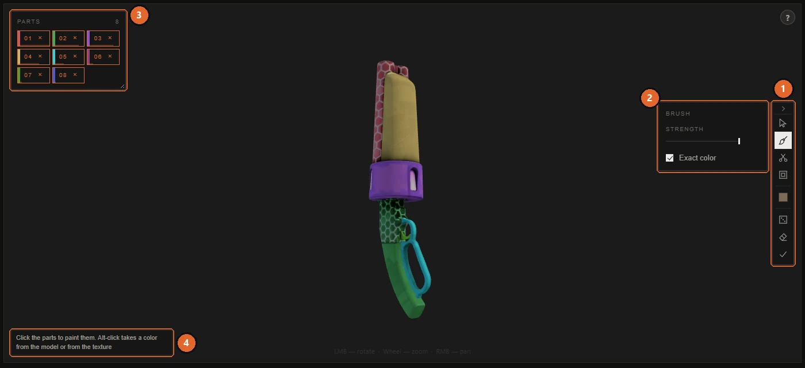

# Painting by parts

[Documentation](../README.md) · [Русская версия](../ru/model-parts.md)

Most TF2 weapons have a single material, which means a single texture for the whole model. You can't give the barrel one material and the stock another, but you can paint the area of the texture that the barrel uses. Painting by parts does exactly that: it splits the model into pieces you can click on, and everything you do to a piece lands in its area of the texture.

The result is an ordinary texture, so a mod painted by parts installs and works like any other skin.

## Opening it

Press **Split into parts** under the 3D view. It's available for models the app decompiles: weapons, cosmetics, class bodies and hands. It works only in the **Model** scene and not while you're fitting a custom model.

You can also drop an image straight onto the model. The app highlights the piece under the cursor, puts the image on it and opens the parts mode.

Three things appear over the 3D view:

- **The tool column** on the right edge: icons for the tools, the current color, and buttons for the whole job. Next to it a small panel shows the options of the selected tool. The arrow at the top of the column folds it away.
- **The parts list** on the left: one numbered chip per part. Hovering a chip lights up its piece on the model. You can drag the list by its title, resize it from the bottom right corner, and double-click the title to put it back.
- **A hint** at the bottom of the view that says what the current tool will do.

1. The tool column.
2. The options of the selected tool, here the brush.
3. The parts list.
4. The hint.

## What counts as a part

A part is a connected piece of geometry: the revolver's cylinder, its frame, its barrel. That's how people see a model, and it keeps the list short. A revolver has 29 such pieces against 106 UV islands.

Chip numbers stay attached to places on the model. When you cut piece 04 into smaller ones, they become `04·1`, `04·2` and so on, so you can still tell where they came from. The chip's size reflects how much of the texture the part takes, and its tooltip gives the exact share.

**Parts that share texture space.** Sometimes several pieces use the same area of the texture. The left and right halves of a symmetric model are the usual case: the artist mirrored them to save space. In game they share the same pixels, so they can't look different, and painting one paints the other. Such chips are marked, and their tooltip says so. The app also cuts both halves together for the same reason.

If the model is one solid piece, there's nothing to split, and the hint tells you so.

## Tools

| Tool | What a click on a part does |
|---|---|
| Image (cursor icon) | Puts an image on the part. Click a part to choose a file, or drag an image onto it. |
| Brush | Paints the part with the current color or gradient. |
| Scissors | Selects pieces of the surface to cut the part finer. See [Cutting parts](#cutting-parts-finer). |
| Outline | Draws an outline along the edges of the parts you paint. |
| Color square | Opens the color picker. The second square appears when a gradient is on. |
| Die | Paints every part in random colors. Click parts afterwards to fix what you don't like. |
| Eraser | **Clear all**: removes every color, image and outline from the parts. <kbd>Ctrl</kbd>+<kbd>Z</kbd> brings it back. |
| Check mark | **Done**: leaves the parts mode. Your work stays. |

No tool is selected when the mode opens, so your first click on the model doesn't paint anything by accident.

## Painting with color

Take the brush and choose a color in the color square, then click parts on the model or chips in the list.

| Option | What it does |
|---|---|
| **Strength** | How strongly the color covers the original texture, from 20 to 100 percent. |
| **Exact color** | On (default): the color lands exactly as you picked it, and the texture's detail survives through its own light and shadow. Off: the color is blended with the original based on its brightness, which looks more natural on worn metal but drifts from the color in the picker. |

**Gradient.** In the color picker, **Gradient** switches the brush to a blend from the first color to the second. The bar shows how the blend lies on a part: the squares at its ends mark where each color is pure, and the closer they are, the sharper the transition; the diamond marks the midpoint. Click a square to edit its color. The round dial sets the direction: drag it or use the arrow keys. A tilted gradient is what makes a flat part look rounded.

**Eyedropper.** The eyedropper button in the color picker takes a color from the model or from the texture on the left. Hold the mouse button: the color under the cursor is shown as you move, and it's picked where you release. With the brush in hand, <kbd>Alt</kbd>+click does the same without opening the picker.

A part can have a color and an image at the same time. The color then lies under the image.

## Putting an image on a part

Take the image tool and click a part to choose a file, or just drag an image file onto a part on the model. The image is fitted into the part's area of the texture.

A chip with an image gets a **…** button (with a number if there are several images). It opens the placement window. The **×** on a chip removes everything you did to that part and returns its game texture.

### The placement window

The window shows the part's real area on the texture: the triangles that make up its UV island, not a rectangle around them. Whatever falls outside these triangles is cut off when the mod is built, so what you see here is what you get.

| Area | What's there |
|---|---|
| **Layers** (left) | The images on this part. The top row lies over the others; drag a row to reorder. **+ Add** puts one more image on top, **Replace…** swaps the file and keeps the placement, **Remove** takes the image off. **Copy** and **Paste** move an image with its placement between parts. |
| Canvas (middle) | Drag the image to move it. Drag the small squares to resize; dragging past the opposite edge mirrors the image. Rotate with the round handle or the arrow keys. The wheel zooms. |
| **View** (under the canvas) | **Zoom** brings the canvas close to the part, which helps with small pieces. **No game texture** hides the original so your image's edges are easier to see. **Mesh** shows the part's triangles instead of its outline. |
| Properties (right) | The same placement in numbers. **Fit**: **Whole** fits the image inside the area keeping proportions, **Fill** covers the area and lets the edges go under the mask, **Stretch** fills it without keeping proportions. **Size, %** for width and height (a negative value mirrors). **Rotation, °**. **Offset, % of the area** to the right and down. **Reset placement** returns to the initial fit. |

**Done** applies the changes, **Cancel** discards them.

**Copying to other parts.** <kbd>Ctrl</kbd>+<kbd>C</kbd> in the placement window copies the image together with its size on the texture. Then hover another part on the model and press <kbd>Ctrl</kbd>+<kbd>V</kbd>: the image lands there at the same size, as a new layer. This is the quickest way to put the same logo on several pieces.

### Animated images

A GIF on a part becomes an animated texture in the mod: the build bakes every frame. In the preview the animation plays only with **Settings → Play GIFs on the model** turned on. It's off by default because every stroke recalculates the frames, which takes seconds, and keeps them in video memory, which can take hundreds of megabytes.

## Cutting parts finer

The automatic split doesn't always match what you want to paint. The Spy's hand is one piece of geometry, but you may want to color the fingers. The scissors handle that.

Take the scissors and choose how to select:

| Mode | How it selects |
|---|---|
| **Piece** | A click takes a smooth surface up to its sharp edges. **Edge sharpness** sets the threshold: lower values break a detail into separate faces, higher values take larger areas. |
| **Brush** | Drag over the model and everything under the brush is selected. **Brush size** sets the radius, **Erase** removes from the selection instead. Dragging off the model still rotates the camera. |
| **Island** | A click takes a whole UV island. |

The panel shows how many triangles are selected. **Separate** (or <kbd>Enter</kbd>) turns the selection into a new part, **Reset** (or <kbd>Esc</kbd>) clears it.

**Merging parts.** With the scissors active, a click on a chip selects the whole part. Select two parts this way and press **Separate**: they become one part.

**Split by UV islands** is a slider that cuts every piece along its UV islands at once. Moving it further cuts more finely.

A part you cut off gets a **−** button on its chip that grows it back into the piece it came from. <kbd>Ctrl</kbd>+<kbd>Z</kbd> works too.

## Outline

The outline tool draws a line along the edges of the parts you paint. Press **Outline** to turn it on, pick its color, and set the **Width**. From then on, every part you paint gets an outline. It's a quick way to get a cartoon look or to separate parts painted in similar colors.

## Teams, styles and model states

Parts paint whatever card the preview shows. With **BLU** active, you paint the blue texture; with **Australium** on, the gold one; with a style selected, that style's texture. Each of them keeps its own strokes.

Parts work on the main state of the model. If you switched **Model state** to the broken bottle or the exploded Caber, switch it back before painting.

## Undo and saving

Everything in the parts mode goes into the same history as the rest of the item: <kbd>Ctrl</kbd>+<kbd>Z</kbd> undoes the last step, <kbd>Ctrl</kbd>+<kbd>Y</kbd> redoes it. The work is saved in the item's draft along with everything else, and the next build bakes it into the texture at the resolution you chose.

Loading a custom model resets the parts: its triangles are different, so the old parts don't apply to it.

## See also

- [War Paint](war-paint.md): the parts you cut also work as targets for War Paint patterns.
- [Your first skin](reskin.md): the general flow of painting and building.
