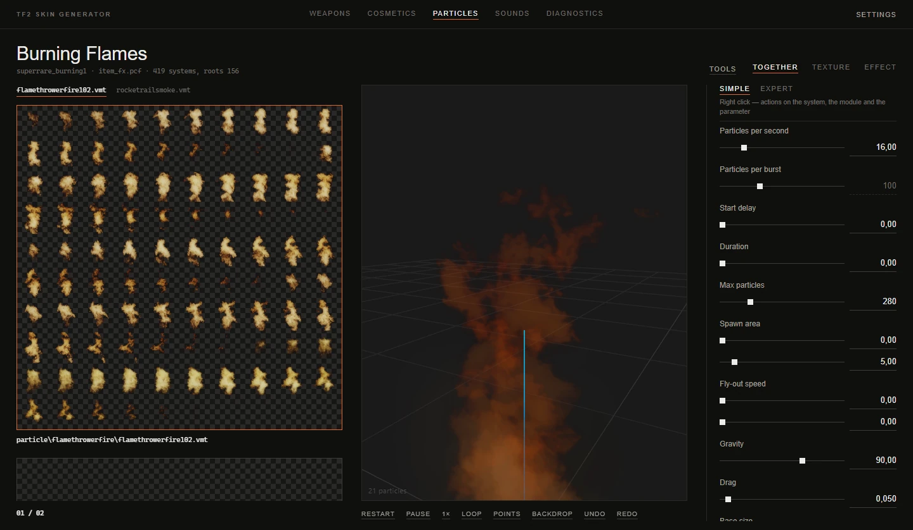

# Particle editor

[Documentation](../README.md) · [Русская версия](../ru/particles.md)

The **Particles** section edits the game's particle effects: unusual effects, explosions, muzzle flashes, building effects, map ambience. Effects live in PCF files inside the game, and each file holds many systems. The editor opens a PCF, shows its systems as a tree, plays the selected effect in the preview the way the game would, and builds a mod with your changed file.

## Finding an effect

The catalog of this section works in two modes, switched by the **Show** list at its top:

- **All game effects** lists every effect in the game by name. This is where you start.
- A file name (for example `class_fx.pcf`) opens that file and shows the tree of its systems.

**Search** finds effects by their in-game names and by system names. Unusual effects carry the names players know: searching `Burning Flames` finds the system `superrare_burning1`. While the app is still indexing the effects after launch, the search covers only names from the game, and a note says so.

**Source** narrows the list by what triggers an effect: **Weapons**, **Buildings**, **Player**, **Impacts and explosions**, **Unusuals**, **Taunts**, **Halloween**, **MvM**, **Modes and rules**, **Maps and ambience**. Each button shows how many effects it covers.

Clicking an effect opens its file and selects the system. The title shows the in-game name, the system name, the file and the number of systems in it.

## The system tree

Inside an open file, systems are shown as a tree: a child system sits under its parent, and a triangle folds the children away. Turn off **Settings → Group the particle tree** for a flat list.

A system that differs from the game is marked **Changed from the game version**, and a system that the game doesn't have is marked **Not in the game**.

Right-clicking a system opens its menu:

| Item | What it does |
|---|---|
| **Copy every parameter of the system** | Puts the whole system on the clipboard as JSON. <kbd>Ctrl</kbd>+<kbd>C</kbd> does the same. |
| **Paste parameters** | Pastes a copied set. See [Copying and pasting](#copying-and-pasting-parameters). <kbd>Ctrl</kbd>+<kbd>V</kbd> does the same. |
| **Add a layer with a custom texture…** | Adds a new child system to draw your own texture on top of the effect. |
| **Rename the system…**, **Duplicate the system…** | Rename or copy the system inside the file. |
| **Add a child…** | Attaches another system of the file as a child (**Attach an existing one…**), or detaches one (**Detach…**). |
| **Texture colors (remove the tint)** | Removes the color modules from the system and its children and sets the base color to white, so the textures show their own colors. |
| **Revert to game version** | Replaces every edit of the system (parameters, modules, children) with the game's version. |
| **Delete the system** | Removes the system from the file. |

## Editing parameters

The panel on the right shows the selected system in one of two modes.

### Simple

The essentials as sliders, each with a short explanation: **Particles per second**, **Particles per burst**, **Start delay**, **Duration**, **Max particles**, **Spawn area**, **Fly-out speed**, **Gravity**, **Drag**, **Base size**, **Size spread**, **Size over life**, **Lifetime**, **Opacity**, **Fade in**, **Fade out**, **Particle colors**, **Spin**. Changes show up in the preview right away.

Some sliders need a module the system doesn't have yet. Where that's safe, the editor adds the module itself. It won't add an emitter, though: a second one would double the burst. If you really need one, add it in expert mode.

### Expert

The whole system as it's stored in the file: groups, modules inside them and every attribute of each module. A system can have around two hundred parameters, so use **Find a parameter**: it filters by attribute and module names, for example `radius`.

The six groups of modules:

| Group | What its modules do |
|---|---|
| **operators** | What happens to a particle over its life |
| **initializers** | How a particle is born |
| **renderers** | How it's drawn |
| **emitters** | How particles are released |
| **forces** | What pushes them |
| **constraints** | What limits them |

Right-click to change the structure:

| Where | Menu |
|---|---|
| A group header | **Add a module…** (common modules are listed first, then everything found in the game's effects), **Copy the "…" group** |
| A module name | **Add a parameter…** (only the parameters the module doesn't have yet, with the value the game's effects use), **Copy this module**, **Delete the module** |
| A parameter | **Copy the "…" parameter**, **Revert to the game value**, **Delete the parameter (back to the default)** |

Changed values are highlighted, so you can see what differs from the game at a glance.

### Copying and pasting parameters

Any part of a system (a parameter, a module, a group or the whole system) can be copied as JSON. A parameter, a module or a group is pasted over the matching parameters right away. When you paste a whole system, **Paste parameters** asks how to apply it:

- **Over**: replace the matching parameters.
- **Without replacing**: add only what's missing.
- **Full replacement**: wipe the system's modules and use the pasted ones.

If the clipboard isn't available, a window with the text opens so you can copy or paste it by hand.

## The preview

The effect plays in the 3D view on the right, simulated the way the game does it. The buttons under the view control playback:

| Button | Key | What it does |
|---|---|---|
| **Restart** | <kbd>R</kbd> | Starts the effect over. |
| **Pause** / **Resume** | <kbd>Space</kbd> | Freezes the effect. |
| **1×** | <kbd>S</kbd> | Switches the time speed: 1×, 0.5×, 0.25×. A crit flash lasts half a second, and slow motion helps to see what happens. |
| **Loop** | | Restarts the effect when it ends. |
| **Points** | | Opens the control points panel. |
| **Backdrop** | | Switches between a dark, a grey and a light background. Translucent layers such as water mist only show on a light one. |
| **Undo**, **Redo** | <kbd>Ctrl</kbd>+<kbd>Z</kbd>, <kbd>Ctrl</kbd>+<kbd>Y</kbd> | Steps through the edit history of the effect. |

<kbd>F11</kbd> expands the view to the whole window.

### Control points

In game, the code places an effect's control points: where the weapon is, which way a projectile flies, what color a killstreak sheen has. In the preview you set them yourself in the **Points** panel:

- **Point** picks a control point. The panel tells you which points the effect actually uses.
- **Position** and **Angles** place it. The angles set the axes of velocity and the plane of sprites.
- **Motion** animates the point: **Still**, **Bobbing up and down**, **A hop to the side**, **In a circle**, **Turning in place**, with an **Amplitude** and a **Period, s**. Trails and smoke look right only when their source moves.
- **Model…** puts a model into the scene. With **On the model**, the point hangs on one of the model's **Attachment points**, the way an unusual effect hangs on a hat: the game uses the `unusual` attachment when a model has one, and otherwise the first bone the model shares with the player.

The model picker uses the same catalog as the other sections. Models you've already opened elsewhere come from the cache right away; others are decompiled first.

## Textures

The album shows the textures of the selected effect. Drop an image on a card to replace a texture, or right-click it:

| Item | What it does |
|---|---|
| **Custom image…** | Picks a file for this texture. |
| **Game texture from the list…** | Uses another texture that already exists in the game's effects. Such a mod works in casual (see [below](#particle-mods-and-casual)). |
| **Custom image resolution: N** | The size your image is scaled to: up to 1024, 512 by default. Bigger looks sharper up close but makes the mod heavier. |
| **Rename the material…** | Gives the material a new path. |
| **Bring back the game texture** | Drops your replacement. |

Some textures are animated sheets with several frames, and a card says so. A custom image replaces such a texture with a single frame, and the app asks before doing it.

## Tools menu

In this section **Tools** has its own items:

| Item | What it does |
|---|---|
| **Open PCF from disk…** | Opens a PCF file that isn't part of the game, for example from another mod. |
| **Save PCF…** | Saves the open file with your changes into the export folder. Available when a file is open. |
| **Parameter reference (JSON)…** | Saves a reference of module parameters as `particle_params.json` in the export folder, including the materials of the open file. |
| **Reference for AI (with a task)…** | The same reference with a task description inside, ready to give to a language model. The parameter set it returns can be pasted with **Paste parameters**. |
| **Open export folder** | Opens the export folder. |

## Building a particle mod

**Build VPK** in this section builds the effect, not a texture. Before building, the app checks the effect for problems that make a mod silently fail in game: systems that end up invisible, an effect hidden from the camera, references to systems that don't exist, and files in `tf/custom` that would conflict with this one. If something is found, the **Check before building** window lists it. **Fix (N) and build** repairs what can be repaired automatically, **Build as is** builds anyway.

Then the app asks for the file name. The result lands in the export folder:

- `name.vpk` holds the changed PCF and your textures.
- `name_textures.vpk` appears when you replaced textures. It holds only the textures, see the next section.

A particle mod replaces the whole PCF file of the game. Two mods that change the same file don't combine: the one whose name comes first alphabetically wins (see [installing mods](troubleshooting.md#installing-a-mod)).

## Particle mods and casual

Custom particle files are blocked by `sv_pure` on casual servers. In local games and on servers that allow custom content, the mod works as is.

Players who want custom particles in casual use [casual-pre-loader](https://github.com/cueki/casual-pre-loader), a separate community tool. The app prepares files for it in two ways:

- **The size limit.** casual-pre-loader doesn't load a PCF larger than the original. The app compresses the file when saving and warns you if it's still bigger: **Built, but the PCF is N B larger than the original — casual will not load it**. Removing unused systems helps.
- **Textures as a separate mod.** casual-pre-loader treats any VPK with a PCF inside as a particle pack and doesn't install textures from it. That's why replaced textures also go into `name_textures.vpk`, which you add on its addons tab.

Textures picked with **Game texture from the list…** don't need any of this: the file is already in the game.

## See also

- [Settings](settings.md): **Group the particle tree**.
- [Installing mods and troubleshooting](troubleshooting.md): where to put the VPK and how sv_pure works.
