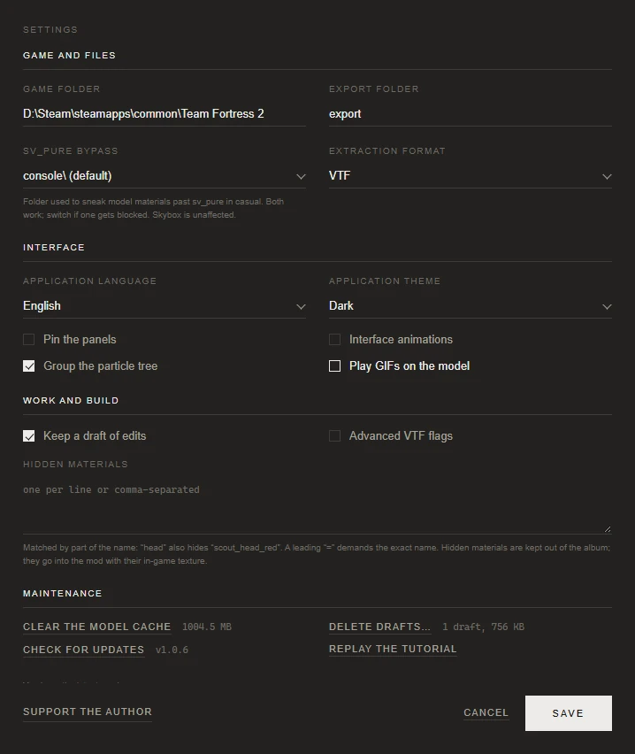

# Settings and data folders

[Documentation](../README.md) · [Русская версия](../ru/settings.md)

**Settings** in the top right corner opens one window with four groups. Changes apply when you press **Save**; **Cancel** closes the window without them. This page goes through every setting and then explains where the app keeps your files.

## Game and files

| Setting | What it does |
|---|---|
| **Game folder** | The TF2 folder, the one that contains `tf` and `bin`, for example `D:\Steam\steamapps\common\Team Fortress 2`. The folder icon opens a folder picker. While the path is missing or wrong, **Detect automatically** appears under the field: it finds the game through the Steam registry entries and Steam's library list, on any drive. A path counts as valid when `bin\studiomdl.exe` and `tf\tf2_misc_dir.vpk` exist in it. |
| **Export folder** | Where built mods and extracted files go. The default is `export`. A relative path is counted from the app's data folder (see [below](#where-the-app-keeps-your-files)), an absolute one is used as is. |
| **sv_pure bypass** | The folder that model materials are moved into so they get past `sv_pure` on casual servers: `console\` (default) or `vgui\replay\thumbnails\`. Both work; the switch is a fallback in case one of them gets blocked. Skyboxes aren't affected. See [troubleshooting](troubleshooting.md#casual-servers-and-sv_pure). |
| **Extraction format** | The file format for **Tools → Extract original texture**: `VTF` (default), `PNG`, `TGA` or `JPG`. It doesn't affect the build, which always produces VTF. |

## Interface

| Setting | What it does |
|---|---|
| **Application language** | English or Русский. The window reloads in the new language and returns to the section you were in. Your edits and caches stay as they were. |
| **Application theme** | Dark (default) or Light. |
| **Pin the panels** | Keeps the catalog on the left and the build settings on the right instead of calling them up over the window. Needs a window wider than 1100 pixels; in a narrower one the option is disabled. |
| **Interface animations** | Panels fading in, the camera flying to a new model, the halves sliding apart. Off means everything switches instantly. |
| **Group the particle tree** | Shows the systems of a particle file as a tree with children under their parents. Off gives a flat list. On by default. |
| **Play GIFs on the model** | A GIF placed on a model part also plays in the 3D view. Off by default: every stroke recalculates the frames, which takes seconds, and keeps them in video memory, which can take hundreds of megabytes. The mod gets the animation either way. |

## Customization

This is where you choose how a build looks in the bottom bar of the window. Above the lists there is a small sample bar. **Play a build** shows your choice from start to finish, and **Play with an error** shows a failed build. Any new choice in a list plays on the sample right away.

| Setting | What you choose | Default |
|---|---|---|
| **Step text** | How the step name appears: letter scramble, typing with a caret, a letter wave, a split-flap board and more. | Letter scramble |
| **Line** | The progress line along the top edge of the bar. Some options only come alive on long steps, so you can see the build has not frozen. | Breathing edge |
| **Counter** | The percentage next to the step name: rolling digits, a count-up, the step number or a hexadecimal value. You can also turn it off. | Rolling digits |
| **Stop button** | Regular, fills up as the build goes, or with a progress ring. | Regular |
| **Bar** | What the bar itself does: nothing, a scanner beam runs across it, it flashes on every step, or its background fills along with the line. | Calm |
| **Finale** | How a successful build ends: team colors meet, a stamp, confetti and more. | Colors meet |
| **Error** | How the line shows a failure: it shakes, shatters or flickers. | Line shakes |
| **Sound** | Clicks on steps, a chime at the end, both, or silence. | Clicks and chime |

With **Interface animations** off, the bar stays simple: the text appears at once, and the finale and error play without motion. Sound does not depend on that option.

## Work and build

| Setting | What it does |
|---|---|
| **Keep a draft of edits** | Writes every edit of an item to a draft on disk, silently. On by default. The draft comes back with **Restore edits**; a work reaches the **Custom Mod** section only through **Save work**. See [Works and drafts](works-and-mods.md). |
| **Advanced VTF flags** | Adds the **Advanced flags** column to the build settings, with flags that a color texture doesn't need or that can harm it. Off by default, and while it's off those flags never reach the build. See the [interface tour](usage.md#vtf-flags). |
| **Hidden materials** | Materials to hide from the album. See below. |

### Hidden materials

Write one pattern per line or separate them with commas. A pattern matches any material whose name contains it: `head` hides `scout_head_red` as well. Start a pattern with `=` to require the exact name: `=scout_head_red` hides only that one material.

Hidden materials aren't shown in the album, and the build writes them into the mod with their game textures without asking.

Some materials are hidden from the start and can't be unhidden here: eyes, teeth, tongues, über overlays, zombie skins, sheen and fresnel overlays. They're still reachable with **Other** under the album.

## Maintenance

| Item | What it does |
|---|---|
| **Clear the model cache** | Deletes the decompiled models. The size of the cache is shown next to the button. After clearing, the first build of each item is slower, because the app decompiles it again. Clear it if models start misbehaving after a game update. |
| **Delete drafts…** | Lists the drafts with their sizes so you can delete the ones you don't need. Saved works aren't listed and aren't touched. |
| **Check for updates** | Asks GitHub whether a newer version exists and shows the current one. See [Updates](#updates). |
| **Replay the tutorial** | Closes the settings and starts the tutorials from the beginning. |
| **Keep temp files on failure** | Keeps the temporary build folder when a build fails, so you can look at the intermediate files. Useful together with a bug report. |
| **Debug mode** | Writes detailed debug entries to the log. Turn it on before reproducing a problem you're going to report. |

**Support the author** in the bottom left corner opens the author's Steam trade offer page, if you'd like to say thanks.

## Updates

The first time you open the settings in a session, the app asks GitHub for the latest release, and **Check for updates** asks again at any time. If a newer version exists, the note under the buttons says so and the button changes:

- **Update** in the installed and the portable app. The app downloads the installer from the release, checks its size and its SHA-256 against the values GitHub publishes, and runs it silently. The app closes, the installer replaces the program files and starts the new version. Your works, mods and settings aren't touched, because they're stored apart from the program. A portable copy is updated in place, without shortcuts or an uninstaller.
- **Open the release page** when the app runs from source code. Update a checkout with git instead.

Pre-releases and drafts on GitHub are ignored.

## Where the app keeps your files

The program files and your data live in different places. An update replaces the program folder completely, so nothing of yours is kept there.

| What | Installed or portable app | Running from source |
|---|---|---|
| Program | `%LOCALAPPDATA%\Programs\Tf2SkinGenerator` by default, or the folder you unzipped | the repository |
| Your data | `%LOCALAPPDATA%\Tf2SkinGenerator` | the repository folder |
| Decompiled model cache | `%USERPROFILE%\.tf2skingen_cache\decompiled` | the same |

Inside the data folder:

| Folder or file | Contents |
|---|---|
| `config\app_config.json` | The settings. Delete it (with the app closed) to return to the defaults. |
| `work\` | Drafts and saved works, one folder per item. |
| `mods\` | The library of opened VPK mods. |
| `export\` | Built mods and extracted files, unless you chose another export folder. |
| `cache\` | Backpack icons, the cosmetics list, the window profile and other things the app can rebuild. |
| `tools\edited_vmt\` | Your VMT edits, one file per material. |
| `tools\temp\` | Temporary build folders. Leftovers of interrupted builds are removed at the next launch. |
| `tf2sg.log` | The log. It's rotated at about 2 MB, keeping two older files (`tf2sg.log.1`, `tf2sg.log.2`). |
| `tf2sg_crash.log` | Stack traces of native crashes, if there ever were any. |

The model cache is limited to about 1 GB. When it grows past that, the entries used least recently are removed. Entries are also rebuilt by themselves when the game updates its archives.

Earlier versions kept data next to the program. The first launch of a newer version moves `config`, `work`, `mods`, `export` and `cache` into the data folder, unless they're already there.

Only one copy of the app can run at a time. Starting it again while it's open does nothing: two copies writing the same settings and drafts would overwrite each other.

## See also

- [Installing mods and troubleshooting](troubleshooting.md)
- [Building from source](building-from-source.md): how the data folder works when you run the code.
