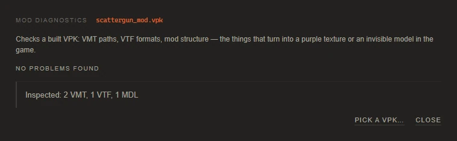

# Installing mods and troubleshooting

[Documentation](../README.md) · [Русская версия](../ru/troubleshooting.md)

## Installing a mod

1. Copy the `.vpk` from the export folder (**Tools → Open export folder**) into the game's `custom` folder:
   ```
   ...\Steam\steamapps\common\Team Fortress 2\tf\custom\
   ```
   Put it directly into `custom`, not into a subfolder of it.
2. Restart the game completely. The game scans `tf/custom` only when it starts.

To remove a mod, delete its `.vpk` from `tf/custom` and restart the game.

**Several mods at once.** The game mounts the contents of `tf/custom` in alphabetical order, and when two mods contain the same file, the one that comes first wins. Two skins for the same weapon don't combine, so keep one mod per item, or merge mods with **Tools → Merge several VPKs into one** and decide which version stays (see [merging mods](works-and-mods.md#merging-several-mods-into-one)). **Diagnostics** warns when a mod overlaps with others in `tf/custom`.

**Test locally first.** A local game, for example one started with the console command `map ctf_2fort`, doesn't restrict custom files. If a mod works there, the mod itself is fine, and any problem elsewhere comes from the server's rules.

## Casual servers and sv_pure

A server with `sv_pure` enabled makes players use the game's own files instead of custom ones. Valve's casual servers run with it: by the [Valve Developer Community](https://developer.valvesoftware.com/wiki/Pure_Servers) description, they allow custom HUDs and viewmodel animations, but not models, materials or sounds. Community servers choose for themselves; many run with `sv_pure 0` and allow everything.

`sv_pure` has exceptions: a few material folders are read from disk even on pure servers. The app uses this for skins that live on a model. When it builds the model, it points its materials into one of these folders, `console\` by default or `vgui\replay\thumbnails\`, and puts the textures there. That's what **Settings → sv_pure bypass** switches.

| Mod | Local game and `sv_pure 0` servers | Casual servers |
|---|---|---|
| Weapons, cosmetics, class bodies and hands, projectiles, pickups, taunt props | works | built with the workaround above |
| Skyboxes | works | not covered: the game's paths are protected |
| Sounds | works | not covered: sound files are protected |
| Particle effects | works | not covered; see [particle mods and casual](particles.md#particle-mods-and-casual) |
| Spy disguise masks, crit text, spray, death effects | works | not covered by the workaround |

Keep in mind:

- **This is a community workaround, not a feature of the game.** Valve can close it with any update. If model skins stop showing on casual servers while they still work locally, switch **sv_pure bypass** to the other folder and rebuild the mod.
- **A server can have stricter rules.** A community server with its own whitelist can block these folders too.
- **Check locally before blaming the mod.** A skin that doesn't show anywhere has a problem of its own; use **Diagnostics**.

## Checking a mod with diagnostics

**Diagnostics** in the header opens a window that inspects a built VPK, yours or anyone else's. Press **Pick a VPK…** and choose the file. The report starts with a summary (**No problems found**, or the number of errors and warnings) and lists the findings by importance. Errors are the reasons a mod breaks in game, warnings are things that may cause trouble, and information entries describe what was checked. Each finding names the file it's about and says what to do.



| Check | What it catches |
|---|---|
| Structure | An empty VPK. An extra wrapper folder: `materials/` and `models/` must sit at the root of the VPK, not inside another folder. A VPK without any of the folders the game reads mods from (`materials`, `models`, `particles`, `sound`, `scripts`), which overrides nothing. |
| VMT syntax | An unclosed brace or quote, a missing shader name. Such a material doesn't load and shows up purple. |
| Missing textures | A VMT points to a VTF that is neither in the mod nor in the game, which shows up as the purple and black checkerboard. Textures the game provides itself are fine and aren't reported. Without a game folder in the settings the app can't look into the game and lists every texture the mod doesn't carry. |
| VTF size | A texture whose sides aren't powers of two (512, 1024 and so on). That can cause artifacts or a failed load. |
| Broken VTF | A file whose header can't be read: it's damaged or empty. |
| Incomplete model | An `.mdl` without its `.vvd` and `.vtx` files next to it. The model would be invisible. |
| Model version | A model compiled for another game or engine version. TF2 may refuse to load it. |
| Model materials | Materials the model asks for that have no VMT in the mod's material folders. If the game doesn't provide them either, they turn purple. |
| Conflicts | Files under `materials/` and `models/` that other mods in your `tf/custom` also contain. Only one version of each file can win, so the result depends on the load order. |

## Common problems

### The app window is blank or does not open

The interface runs in Microsoft Edge WebView2. Without it the window falls back to the old Internet Explorer engine, which can't run the interface, and stays blank. Install the [Evergreen WebView2 Runtime](https://developer.microsoft.com/microsoft-edge/webview2/) from Microsoft and start the app again.

If the window opens but the catalog stays empty, close the app and start it again. The page already retries loading a few times by itself, so this is rare. If a line starting with `JS:` appears where the list should be, that's an error in the app: please [report it](#reporting-a-bug) together with `tf2sg.log` from `%LOCALAPPDATA%\Tf2SkinGenerator`.

Only one copy of the app runs at a time. If nothing happens when you start it, look for a running `Tf2SkinGenerator.exe` in Task Manager.

### "TF2 not found" in the bottom bar

Open **Settings** and set **Game folder** to the folder that contains `tf` and `bin`, or press **Detect automatically**. The app accepts a folder only when `bin\studiomdl.exe` and `tf\tf2_misc_dir.vpk` exist in it. If they're missing, verify the game files in Steam.

### "Crowbar NOT FOUND" in the bottom bar

The decompiler ships with the app in `tools\crowbar`. If it's gone, an antivirus may have quarantined it. Restore it, or reinstall the app.

### The mod doesn't show up in game

Go through these in order:

1. The `.vpk` is directly in `tf/custom`, not in a subfolder and not still in the export folder.
2. The game was fully restarted after copying.
3. You're testing locally or on a server that allows custom content (see [sv_pure](#casual-servers-and-sv_pure)).
4. No other mod in `tf/custom` replaces the same item and comes first alphabetically.
5. **Diagnostics** finds no errors in the file.

### Purple and black checkerboard

The game can't find a texture. Run **Diagnostics** on the mod: it shows which VMT points where. Common causes: an image was never given to a material and the game doesn't have the original, a VMT edit points `$basetexture` to a texture that isn't in the mod, or the mod was built for an older version of the model. After building, the status line may also warn that a game texture wasn't found; giving that material your own image fixes it.

### The model is invisible in game

Usually a broken VMT or missing model files. **Diagnostics** reports both. With a custom model, also check its size and position with **Scale & fit**.

### A cosmetic or weapon turns one solid color in game

The material takes its color from the VMT wherever the texture's alpha is white, and your image has no alpha. Rebuild and answer **As in the image** when the build asks about paint, or give the image a proper alpha mask. See [Cosmetics](cosmetics.md#team-colors-and-game-paints).

### The build fails

The error window explains what went wrong and keeps the original message under **Technical details**. The full story is in the log: press <kbd>`</kbd> in the app, or open `tf2sg.log`. Common causes:

- `studiomdl` rejected a custom model: see [custom models](custom-models.md#troubleshooting).
- A file was locked by another program, for example the game or an antivirus scanning the export folder. Try again.
- The game was updated while the app was running. Restart the app.
- The path is too long. `vpk.exe` can't open a file whose full path is longer than 260 characters, and the technical details then show `error opening required file` with a cut-off name. It happens when the portable copy sits in a deeply nested folder. Move it closer to the drive root, for example to `D:\Tf2SkinGenerator`.

### The first load of an item is slow

The first time, the app extracts the model from the game archives and decompiles it. The result goes into the cache, and the next time the item opens almost instantly.

### Things break after a game update

The cache rebuilds entries when the game archives change. If an item still misbehaves, use **Settings → Clear the model cache** and rebuild the mod. Mods built before an update can break when Valve changes a model; rebuilding them fixes that.

### A replaced sound is silent

The file doesn't match the format the entry expects. An entry that plays `.mp3` needs a real MP3; a WAV renamed to `.mp3` plays nothing. See [Sounds](sounds.md#formats-the-game-accepts).

## Reporting a bug

Bug reports go to [GitHub Issues](https://github.com/xietyBTW/Tf2SkinGenerator/issues). A useful report has:

1. The app version from **Settings → Maintenance**.
2. What you did, step by step, and what you expected instead.
3. The text of the error window: **Copy** puts all of it on the clipboard.
4. The log. Turn on **Settings → Debug mode** and **Keep temp files on failure**, reproduce the problem, then press **Log folder** in the log panel and attach `tf2sg.log`.
5. The `.vpk`, if the problem is with a built mod.

## See also

- [Settings and data folders](settings.md)
- [Your first skin](reskin.md)
