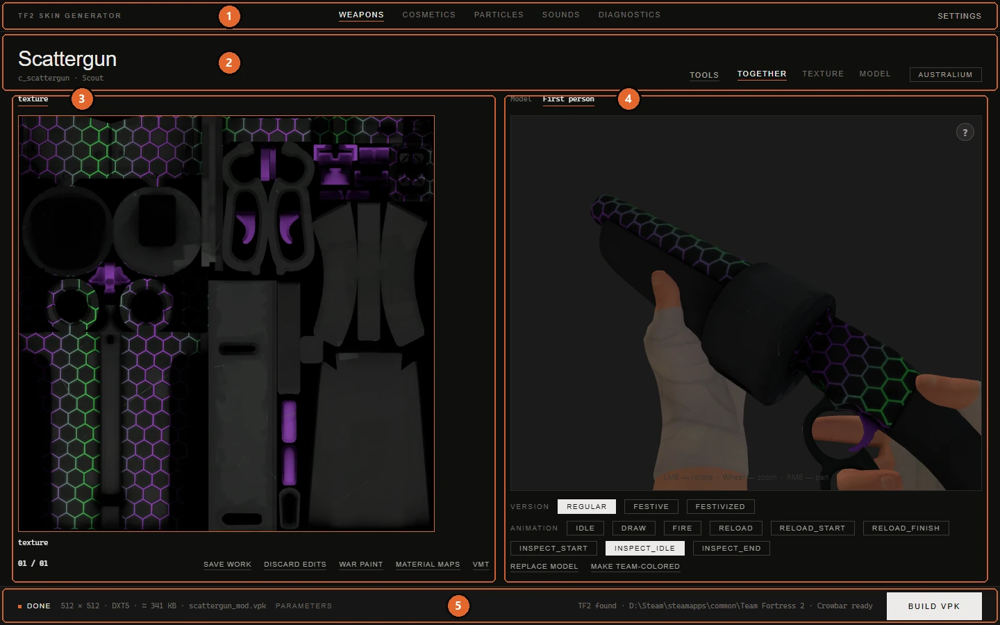

# Interface tour

[Documentation](../README.md) · [Русская версия](../ru/usage.md)

This page goes through the window part by part and lists what every control does. If you only want to make a skin, [Your first skin](reskin.md) is the shorter way in. Come back here when you want to know what a particular button is for.

Most buttons appear only when they make sense for the selected item. A weapon with no team variant has no **RED** and **BLU**, a skybox has no **Replace model**, and so on. If something from this page is missing on your screen, the selected item simply doesn't support it.

## The window at a glance

1. [Header](#header): sections and settings.
2. [Title row](#title-row): the selected item, tools, layout and team buttons.
3. [Album](#album): the textures of the model.
4. [Model view](#model-view): the 3D preview, scenes and model actions.
5. [Bottom bar](#bottom-bar): status, build summary and the build button.

The catalog and the build settings don't take room until you call them. With **Settings → Pin the panels** they stay on screen instead: the catalog on the left, the build settings on the right. See [Panels](#panels-and-layout).

## Header

The links at the top switch between sections of the app.

| Section | What it's for |
|---|---|
| **Weapons** | Everything that isn't a cosmetic: weapons, class bodies and hands, special effects, projectiles, pickups, taunt props, skyboxes and opened VPK mods. Each has its own category in the catalog. |
| **Cosmetics** | Hats, misc items and medals, with their own search and filters. See [Cosmetics](cosmetics.md). |
| **Particles** | The particle effect editor. See [Particle editor](particles.md). |
| **Sounds** | Replacing game sounds. See [Sounds](sounds.md). |
| **Diagnostics** | Opens a window that checks a built VPK. It doesn't leave the current section. See [troubleshooting](troubleshooting.md#checking-a-mod-with-diagnostics). |

**Settings** on the right opens the settings window, described in [Settings and data folders](settings.md).

## Title row

**Item name.** The large label on the left names the selected item, with its model file and class next to it. Clicking it opens the catalog. Before anything is selected it reads **Select an item**.

**Tools** opens a menu of operations on the selected item. Its content depends on the section:

| Item | What it does |
|---|---|
| **Extract model (SMD)** | Decompiles the item's model and lists every file Crowbar produced: the reference mesh, LODs, physics, animations, the QC. The reference SMD is ticked by default because that's the geometry itself. The ticked files are copied into the export folder. Useful as a base for a [custom model](custom-models.md). |
| **Export UV template (PNG)** | Draws the model's UV layout into a 1024 × 1024 PNG in the export folder so you can paint over it. Each material has its own layout and gets its own file. The templates also appear as extra cards in the album, next to the textures they belong to. |
| **Extract original texture** | Saves the game's texture of the selected item into the export folder. For class bodies, which have a couple dozen textures, it first asks which ones to extract. The file format is set in **Settings → Extraction format**. |
| **Merge several VPKs into one** | Combines mods from the export folder into a single VPK. See [merging mods](works-and-mods.md#merging-several-mods-into-one). |
| **Open export folder** | Opens the export folder in Explorer. Available in every section that has a title row, which is all of them except **Sounds**. |
| **Open PCF from disk…**, **Save PCF…**, **Parameter reference (JSON)…**, **Reference for AI (with a task)…** | Particle section only. See [Particle editor](particles.md#tools-menu). |

The extraction and UV items appear for anything with a model. Skyboxes, sprays, the crit text and death effects have no model, so the menu doesn't offer them there.

**Together, Texture, Model** change the layout of the working area: both halves, only the album or only the 3D view. In the particle section the last button reads **Effect**.

**Team buttons** sit on the right of the title row:

| Button | When it appears | What it does |
|---|---|---|
| **RED**, **BLU** | The model has separate team textures, or you pressed **Make team-colored**. | Switches the album and the preview to that team. Images you drop go to the active team. |
| **Australium** | The weapon has a gold version. | Shows the gold version in the album and the preview. |
| **Paint** | Cosmetics only. | Opens the list of in-game paints to preview the item painted. A colored dot on the button shows the active paint. The paint is only a preview, it doesn't go into the mod. See [Cosmetics](cosmetics.md#previewing-game-paints). |

## Catalog

The catalog is where you pick what to work on. In the default layout it opens over the window when you click the item name, and closes after you pick something. <kbd>Esc</kbd> or **Close** hides it without picking.

**Search.** The box at the top (**Name or file**) searches as you type. Every word has to appear somewhere in the item name, model file or class, in any order. In the cosmetics section the search is smarter: it ranks results, also matches the English name when the interface is in Russian, and suggests similar names when nothing is found.

**Category** (Weapons section only):

| Category | What's inside | Filters |
|---|---|---|
| **Weapon** | Weapons of every class, one card per model, including all-class melee weapons and the festive weapons that have a model of their own | **Class**, **Type** |
| **Character** | Each class's body (**Player Skin**) and first-person hands. The Spy also has **Disguise Masks**, the Engineer the MvM **Robot Hand** | **Class** |
| **Special** | **Crit**, **Spray**, **Death effect: Ice**, **Death effect: Gold**, **Death effect: Fire** | none |
| **Projectiles** | Rockets, grenades, stickybombs, arrows, flares and other projectiles | none |
| **Health & Ammo** | Health kits and ammo packs, including the Halloween and birthday versions | none |
| **Taunt Props** | Items that appear in taunts | none |
| **Skybox** | **All maps (all stock skies)** and every sky found in your game | none |
| **Custom Mod** | Your saved works and VPK mods you opened | none |

Details on characters, special effects and skyboxes are in [their own guide](special-items.md), and the **Custom Mod** library is in [Works, drafts and the mod library](works-and-mods.md).

**Filters** are rows of buttons under the category. **All** removes the filter. Under the filters you see how many items are shown, so it's clear whether a filter narrowed the list.

**Cards** show the item's backpack icon where the game has one, and the model's texture otherwise. The line under the name is the model file, or the class for cosmetics. A cosmetic with several model styles gets a small "3 styles" mark.

## Album

The left half of the working area lists the textures of the model, one card per material.

**Moving between cards**: the tabs above the album, the arrows on its sides, the mouse wheel, or a click on a card. The counter in the bottom left corner shows your position, for example `02 / 03`. The 3D view shows the texture of the card the album stops on, which matters for models where several textures share one mesh, like the Spy's masks.

**Putting an image on a card**: drag it onto the card, or double-click the card to pick a file. Images and VTF files are accepted. GIF and animated PNG become animated textures.

**Card buttons** appear in the card's corner:

| Button | What it does |
|---|---|
| Settings (two sliders) | Gives this material its own resolution, format and flags. See [per-texture settings](#per-texture-settings). |
| **×** | Only on a style's card: removes the material from the style, so it inherits the base texture again. |

**Buttons under the album:**

| Button | When it appears | What it does |
|---|---|---|
| **Save work** | The item has edits that aren't saved as a work yet. | Puts the work into the **Custom Mod** section, where you can reopen it later. |
| **Restore edits** | The item has a draft from earlier, and nothing is changed yet in this session. | Brings the draft back. |
| **Discard edits** / **Delete work** | The item has edits or a saved work. | Returns the item to its game look and deletes the draft or the work from disk. |
| **War Paint** | A weapon held in hand. | Opens the War Paint panel. See [War Paint](war-paint.md). |
| **Material maps** | Anything with a model. | Gloss, glow, reflection mask and other maps for the current material. See [Materials and effects](materials.md#material-maps). |
| **VMT** | Models, except opened VPK mods. | Opens the VMT editor for the current material. See [Materials and effects](materials.md#the-vmt-editor). |
| **Other** | The model has service materials. | Shows them as cards: eyes, teeth, über overlays and the like. |

How saving and drafts work is explained in [Works, drafts and the mod library](works-and-mods.md).

**Style bar.** When a texture style other than the base one is selected in the **Style** row, a line under the album explains what you see. A style overrides the base selectively: the album lists only the materials the style changes, and the rest come from the base. **Add material** adds one more material to the style so you can give it its own texture.

## Model view

The right half shows the item in 3D.

| Action | Mouse |
|---|---|
| Rotate | Left button, drag |
| Zoom | Wheel |
| Pan | Right button, drag |

<kbd>F11</kbd> expands the view to the whole window. <kbd>F11</kbd> or <kbd>Esc</kbd> brings the interface back.

### Scenes

The buttons above the 3D view choose what it shows.

| Scene | Available for | What you see |
|---|---|---|
| **Model** | everything | The item alone with a free camera. |
| **First person** | weapons held in hand | The weapon in the hands of its class from the player's eyes, with the weapon's own animations. |
| **Taunt** | taunt props | A class performing the taunt with the prop. |
| **On the model** | cosmetics | The cosmetic on a class standing in the pose of the chosen weapon slot. |

Scenes take a few seconds to assemble the first time. Switching animations afterwards is fast because the app reuses the mesh and textures.

### Rows under the view

These rows appear when the item has something to choose:

| Row | What it does |
|---|---|
| **Style** | Skins baked into the model (clean and bloody versions and similar). **Default** is the base skin. |
| **Model state** | States the game switches by itself, such as an intact and a broken bottle. Preview only, every state goes into the mod. |
| **Version** | **Regular**, **Festive**, **Festivized**: shows the festive lights the game hangs on the weapon. With a custom model, **Fit the lights** appears so you can move them onto your geometry. See [festive lights](custom-models.md#festive-weapons-and-their-lights). |
| **Cosmetic style** | Model styles of a cosmetic. Each style has its own geometry, and a dot marks the styles you edited. |
| **Animation** | In **First person**: the animations of this weapon. |
| **Weapons** | In **On the model**: which slot the class holds, which also sets the pose. |
| **Class** | In **Taunt** and **On the model**: which class to show when several can use the item. |

### Model actions

The buttons on the bottom right of the model view work on the model itself:

| Button | When it appears | What it does |
|---|---|---|
| **Replace model** | Anything with a model except class bodies | Loads your own SMD, OBJ, GLB or glTF instead of the game model. See [Custom models](custom-models.md). |
| **Scale & fit** | A custom model is loaded | Shows a translucent copy of the original and lets you move, rotate and scale your model to match it. |
| **Edit QC** | A custom model loaded with its own materials and bones | Opens the model's compile script. |
| **Make team-colored** | The item has no team variant and can get one | Adds RED and BLU versions. |
| **Split into parts** | Models that came from decompiling: weapons, cosmetics, bodies, hands | Opens painting by parts. See [Painting by parts](model-parts.md). |
| **Remove custom model** | Your model, or your festive lights, are in place | Brings back the game model. If both are replaced, it asks which one. |

## Bottom bar

| Element | What it does |
|---|---|
| Status | The current state: **Done** when nothing is running, loading messages, build steps, results. Clicking it opens the [log](#log). |
| Summary | What the build will produce: resolution, VTF format, the estimated size of one texture, the file name. It updates as you change settings. |
| **Parameters** | Opens and closes the build settings. With pinned panels they are always on screen. |
| Game path | Where TF2 was found and whether Crowbar is in place. If the game isn't found, set it in the settings first. |
| **Build VPK** | Builds the mod. During a build it turns into **Stop**. |

## Build settings

The build settings apply to the whole mod. Some of them are locked or hidden for items where they make no sense. The build ignores hidden settings, so a value you can't see never ends up in the mod.

### Resolution and format

| Setting | Notes |
|---|---|
| **Resolution** | 256, 512, 1024 or 2048 pixels per side. Sprays are fixed at 256. |
| **VTF format** | The texture format. `DXT1` (no alpha) and `DXT5` (with alpha) are compressed and cover almost every case. `RGBA8888` and `BGRA8888` are uncompressed. The crit text accepts only formats with alpha (`DXT5`, `RGBA8888`, `DXT3`), skyboxes only formats without it (`DXT1`, `BGR888`), and sprays don't let you change the format. |
| **VPK name** | The mod's file name, 50 characters at most, without `\ / : * ? " < > \|`. The app suggests a name from the item until you type your own. |

### VTF flags

| Flag | What it does |
|---|---|
| **Clamp S**, **Clamp T** | The texture doesn't repeat past its edge horizontally (S) or vertically (T). Useful for decals and images that shouldn't tile. |
| **No LOD** | The game's texture quality setting won't lower this texture's resolution. |
| **No minimum Mipmap** | Keeps the smallest mip levels that the game would otherwise drop. |
| **Point Sample** | No smoothing between pixels, which keeps pixel art crisp. For skyboxes this is the only flag offered: the app sets the rest itself. |

**Settings → Advanced VTF flags** adds a separate **Advanced flags** column with flags a color texture either doesn't need or shouldn't have: Clamp U, Border, Trilinear, Anisotropic, SSBump, Vertex Texture, No Debug Override, Single Copy, No Depth Buffer. SSBump, for instance, tells the shader the texture is a bump map. Leave them off unless you know exactly why you need one. When the column is hidden, its flags don't go into the build.

### Options

| Option | What it does |
|---|---|
| **No Mipmap** | Builds the texture without mip levels. It saves a little space, but distant surfaces start to shimmer. |
| **No Thumbnail** | Leaves out the small preview image inside the VTF. |
| **No Reflectivity** | Doesn't compute the reflectivity value stored in the VTF header. |
| **Gamma correction** | Applies gamma correction with the value in the field next to it (2.2 by default). |
| **Isolate shoulders** | First-person hands only. See [Characters](special-items.md#isolating-the-shoulders). |
| **Game paints** | Cosmetics only. Keeps the in-game team colors and paints working on your texture. See [Cosmetics](cosmetics.md#team-colors-and-game-paints). |
| **Normal Map** | Builds surface relief from the texture's brightness. See [Materials and effects](materials.md#normal-map). |

Spray, crit and death effect builds lock the VTF flags. For skyboxes the only flag on offer is **Point Sample**, because the app sets the others itself.

### Per-texture settings

The settings button in the corner of an album card switches the panel to that one material. A bar with **Texture: name** appears at the top, and any change you make now is stored for this material only. A badge on the card marks materials with their own settings.

**Done** (or another click on the same card button) returns the panel to the common settings. **Reset** removes the material's own settings. While you edit one material, the build still uses the common settings for everything else.

## Panels and layout

**Floating panels** are the default. The catalog and the build settings appear over the window when you call them and get out of the way afterwards.

**Pinned panels** (**Settings → Pin the panels**) keep the catalog on the left and the build settings on the right at all times. They need a window wider than 1100 pixels; in a narrower window the app switches back to floating panels on its own and restores your choice when the window is wide enough again.

You can drag the inner edge of a pinned panel to change its width, and drag the gap between the album and the 3D view to give one half more room. The app remembers these sizes between launches.

**Settings → Interface animations** turns off the transitions: panels fading in, the camera flying to a new model, the halves sliding apart. Everything then switches instantly.

## Dialog windows

Most questions use the same small window: a title, an explanation, a list of choices with a hint under each one, and **Cancel**. Closing a question about a build cancels the build.

**When something fails**, the app opens a window with a plain explanation and what to do about it. **Technical details** holds the original error message. **Open the log** opens the folder with the log file, **Copy** copies the explanation together with the details.

## Log

The log shows what the page asked the app and what the app was doing meanwhile: which files it found, what Crowbar and studiomdl said, why something failed. Open it with <kbd>`</kbd> (the key left of <kbd>1</kbd>) or by clicking the status in the bottom bar.

| Control | What it does |
|---|---|
| **Calls**, **Errors**, **Warnings**, **Info**, **Debug** | Show or hide each kind of entry. Calls, errors and warnings are on by default. Your choice is remembered. |
| **Search the log** | Filters the entries by text. |
| **Full width** | Expands the log across the window. |
| **Copy** | Copies the visible entries. |
| **Log folder** | Opens the folder with `tf2sg.log`, the complete log. |
| **Clear** | Clears the panel. The log file stays as it is. |

The left edge of the log can be dragged to change its width. Debug entries appear only with **Settings → Debug mode** turned on.

## Tutorials

The main tutorial starts by itself on the first launch. Smaller ones start the first time you open the **Cosmetics**, **Particles** and **Sounds** sections, painting by parts, model fitting and the War Paint panel. Some steps wait for you to do something, for example to pick a weapon. They say **I'll continue once you do it**.

**Skip tutorial** closes the current one. **Settings → Replay the tutorial** shows all of them again.

## Keyboard shortcuts

| Keys | Where | What they do |
|---|---|---|
| <kbd>F11</kbd> | everywhere | Expand the 3D view to the whole window and back |
| <kbd>Esc</kbd> | everywhere | Close a menu, a floating panel or the catalog; leave the expanded view |
| <kbd>`</kbd> | everywhere | Open or close the log |
| <kbd>Ctrl</kbd>+<kbd>Z</kbd> | Weapons, Cosmetics | Undo the last edit of the item |
| <kbd>Ctrl</kbd>+<kbd>Y</kbd> or <kbd>Ctrl</kbd>+<kbd>Shift</kbd>+<kbd>Z</kbd> | Weapons, Cosmetics | Redo |
| <kbd>Ctrl</kbd>+<kbd>C</kbd>, <kbd>Ctrl</kbd>+<kbd>V</kbd> | image placement | Copy an image with its placement, paste it on the part under the cursor |
| <kbd>Alt</kbd>+click | painting by parts, brush | Pick a color from the model or the texture |
| <kbd>Enter</kbd>, <kbd>Esc</kbd> | painting by parts, scissors | Separate the selection, clear the selection |
| <kbd>G</kbd>, <kbd>R</kbd>, <kbd>S</kbd> | model fitting | Move, rotate, scale |
| <kbd>X</kbd>, <kbd>Y</kbd>, <kbd>Z</kbd> | model fitting, during an operation | Lock to an axis; press again to unlock |
| <kbd>Ctrl</kbd>+<kbd>S</kbd> | VMT and QC editors | Save |
| <kbd>Space</kbd>, <kbd>R</kbd>, <kbd>S</kbd> | particle preview | Pause, restart, switch time speed (1×, 0.5×, 0.25×) |
| <kbd>Ctrl</kbd>+<kbd>Z</kbd>, <kbd>Ctrl</kbd>+<kbd>Y</kbd> | Particles | Undo and redo edits of the effect |
| <kbd>Ctrl</kbd>+<kbd>C</kbd>, <kbd>Ctrl</kbd>+<kbd>V</kbd> | Particles | Copy all parameters of the selected system, paste a copied parameter set |
| <kbd>↑</kbd> <kbd>↓</kbd>, <kbd>Space</kbd>, <kbd>Enter</kbd>, <kbd>Delete</kbd> | sound list | Move, play, choose your own file, remove your file |

Shortcuts with <kbd>Ctrl</kbd> work in any keyboard layout. They don't fire while you're typing in a text field or while a dialog is open.
