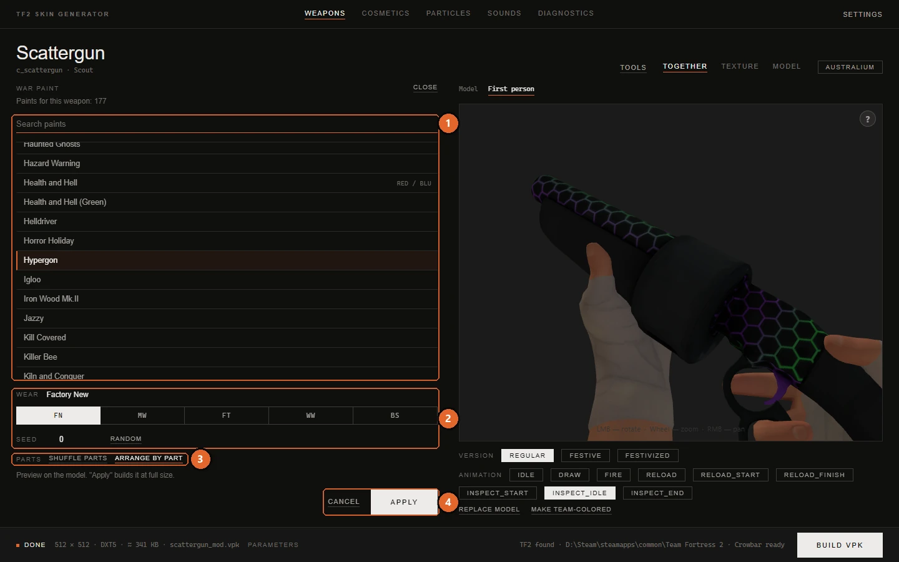

# War Paint

[Documentation](../README.md) · [Русская версия](../ru/war-paint.md)

In TF2 a War Paint isn't a texture. It's a recipe: the game takes the weapon's own texture and layers patterns, colors, wear and stickers on top of it while you play. The app runs the same kind of recipe once and bakes the result into an ordinary texture. That texture becomes your starting point: you can keep it as it is, paint over it, cut it into parts or add effects, and build it like any other skin.

## Opening the panel

The **War Paint** button under the album appears for weapons that a class holds in hand. Projectiles, pickups and taunt props don't have it.

The panel takes the album's place while the model stays visible on the right, so every choice you make shows up on the model right away. The line under the title tells you which mode you're in: **Paints for this weapon: N** when the game has War Paints for it, or **Universal mode** when it doesn't (see [below](#universal-mode)).

1. **Search paints** and the list of paints for this weapon.
2. **Wear** and **Seed**.
3. **Shuffle parts** and **Arrange by part**.
4. **Cancel** and **Apply**.

**Close** and **Cancel** both leave the panel without changes and put the real textures back on the model.

## Picking a paint

Type in **Search paints** to filter the list, then click a paint. A quick 512-pixel preview is built and laid over the model within a moment. Nothing is applied yet, so you can go through the list freely.

Some paints are marked **RED / BLU**: their pattern differs between teams, and the app builds the version for the team that is active right now.

From the search box you can use the keyboard: the arrow keys move through the list, <kbd>Enter</kbd> applies the selected paint, <kbd>Esc</kbd> closes the panel. Double-clicking a paint applies it too.

## Wear and seed

**Wear** has the five in-game grades: **FN** (Factory New), **MW** (Minimal Wear), **FT** (Field-Tested), **WW** (Well-Worn) and **BS** (Battle Scarred). Hover a button to see its full name. Some paints have fewer grades, and then only those are offered.

**Seed** is the number that decides how the pattern lands on the weapon: its rotation, its offset, and where the wear shows up. The game uses the same idea, and any whole number up to 64 bits is accepted. **Random** picks a new seed. Changing the wear or the seed updates the preview.

The app reproduces the game's compositing step by step, so the result is very close to what you see on the weapon in game. An exact match for a given seed hasn't been verified in game, so treat the seed as a way to find a look you like rather than a way to copy a specific item.

## Applying

**Apply** builds the paint at full size (1024 × 1024) and puts it on the weapon's materials that the game paints with War Paints, usually the main one. From this moment it's a regular texture on the card: the preview shows it, you can paint over it, and the build will scale it to the resolution in the build settings.

The paint goes onto the cards of the active team. If the weapon has separate RED and BLU textures, switch to the other team and apply the paint there as well. Alternatively, leave BLU alone and answer **Copy the main one** when the build asks about it.

Applying is a normal edit: <kbd>Ctrl</kbd>+<kbd>Z</kbd> takes it back.

## Universal mode

Most weapons have no War Paints in the game, and neither does a model you loaded yourself or a model from a VPK mod. For them the panel offers every War Paint that is built from a pattern template, in universal mode. The note at the top of the panel says so.

The game's own War Paints rely on masks drawn by Valve's artists for one specific model. In universal mode the app builds those inputs from your model instead: the groups come from the model's parts (or its UV islands, when there are more pattern layers than parts), the wear follows the distance to the edges of each part, and the shading comes from the texture itself. Stickers are left out because there's no place reserved for them. The base under the pattern is the weapon's game texture of the active team, not your earlier edits, so a War Paint never stacks on top of another War Paint.

Two buttons in the **Parts** row control how the patterns are dealt:

- **Shuffle parts** hands the patterns out differently. Click it a few times until the layout looks right.
- **Arrange by part** opens a screen where you choose the pattern for each part yourself.

## Arranging patterns by part

The arrangement screen is available in universal mode and for those of the weapon's own War Paints that are split into groups. **Back to paints** (or <kbd>Esc</kbd>) returns to the list.

At the top are the pattern tiles. They work as a brush and as drop targets:

| Tile | Meaning |
|---|---|
| **Base** | The first tile of most templates: their first pattern, which lies wherever no other pattern was chosen. |
| **No pattern** | The first tile of templates that paint over the weapon's own texture. It leaves the weapon's texture as it is. |
| **Pattern 1**, **Pattern 2**, ... | The other patterns of the template. |

Below them is the list of parts. For the weapon's own War Paints these are the groups as Valve's artists marked them. In universal mode they are the model's parts, the same ones you see in [painting by parts](model-parts.md).

There are three ways to assign a pattern:

1. Select one or more rows in the list, then click a pattern tile.
2. Drag rows onto a pattern tile.
3. Click a pattern tile to take it as a brush, then click parts on the 3D model.

Each row shows whether its pattern was chosen by hand or by the automatic layout.

| Button | What it does |
|---|---|
| **Small ones to base** | Moves every part smaller than two percent of the texture to the base pattern, which cleans up the speckled look on small details. |
| **Shuffle** | Deals the patterns at random, making sure large parts get different ones. |
| **Undo** | Undoes the last change of the layout (<kbd>Ctrl</kbd>+<kbd>Z</kbd>). |
| **Reset** | Returns to the automatic layout. |
| **Cut a part** | Opens painting by parts with the scissors, so you can split a part that's too large. A **Back to War Paint** button on the model view brings you back, and the new parts are already in the list. |

The layout is remembered for this paint on this item, and it is part of the item's work.

Some War Paints were drawn for one particular weapon and have no groups to rearrange. For them the **Parts** row doesn't appear.

## Limits

- **The recipe itself can't be changed.** War Paint recipes live in a file that Valve signs, and the game won't start with a modified one. That's why the app bakes the paint into a texture instead of editing the paint.
- **The game won't apply War Paints to your custom model by itself.** In game the patterns follow the UV layout of the stock model. For custom geometry the app offers only universal mode, and the baked texture is what goes into the mod.
- **The War Paint's own material settings aren't copied.** The mod uses the weapon's regular material with the baked texture, so effects that come from the War Paint's material in game aren't carried over.

## See also

- [Painting by parts](model-parts.md): the parts that universal mode deals patterns to.
- [Materials and effects](materials.md): add gloss or reflections on top of the baked paint.
