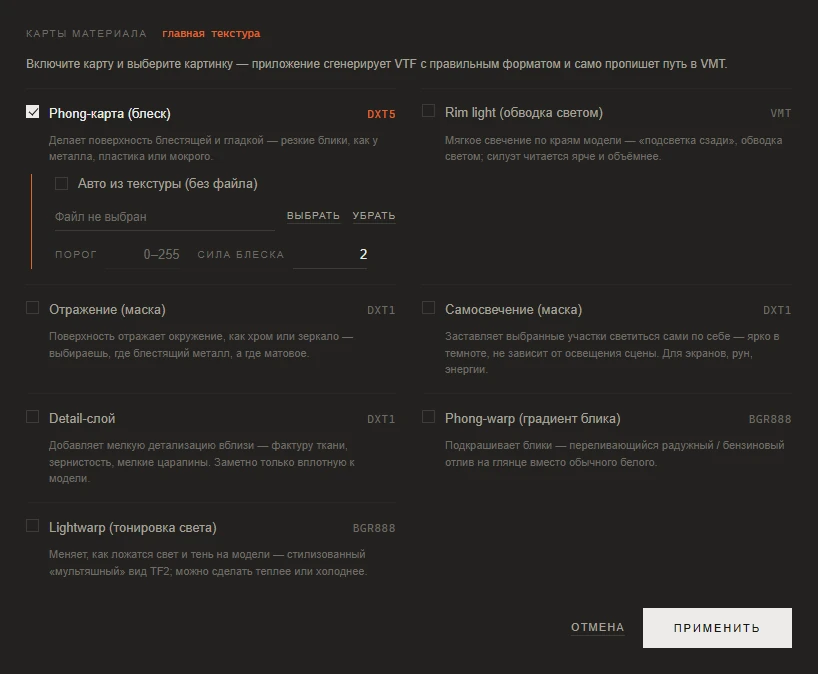
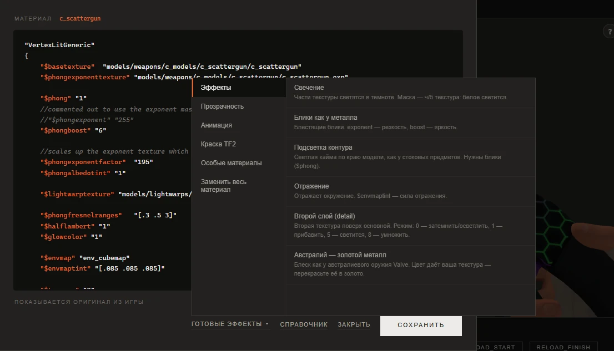

# Материалы и эффекты

[Документация](../README.md) · [English version](../en/materials.md)

Текстура задаёт цвета модели, а то, как эти цвета ведут себя на свету, решает материал: файл VMT рядом с текстурой. Блеск, свечение в темноте, хромированные отражения, прозрачность и анимированные текстуры живут именно там. Работать с материалами в приложении можно тремя способами, от самого простого к самому гибкому:

1. **Карты материала**: выбираете эффект и картинку, а приложение само делает дополнительную текстуру и прописывает её в VMT.
2. **Normal Map** в опциях сборки: рельеф поверхности, построенный по яркости вашей текстуры.
3. **Редактор VMT**: материал в виде текста, с готовыми блоками для частых эффектов и справочником параметров.

Все три доступны у предметов с моделью: оружия, косметики, тел и рук классов, снарядов, аптечек и реквизита насмешек. Они относятся к материалу той карточки, которая выбрана в альбоме.

## Карты материала

Кнопка **Карты материала** под альбомом открывает список дополнительных карт, которые может получить материал. Имя текущего материала написано рядом с заголовком окна. Включите карту галкой, дайте ей картинку и нажмите **Применить**. Приложение переведёт картинку в VTF нужного этой карте формата (он указан справа от её названия) и при сборке допишет в VMT нужные строки. Знать пути и имена параметров не нужно.

| Карта | Что даёт | Авто из текстуры |
|---|---|---|
| **Phong-карта (блеск)** | Резкие блики, как у металла, пластика или мокрой поверхности. **Сила блеска** задаёт их яркость. | да |
| **Rim light (обводка светом)** | Мягкое свечение по краям модели, будто её подсветили сзади. Картинка не нужна, хватает **Резкости** и **Силы**. | картинка не нужна |
| **Отражение (маска)** | Отражения окружения, как у хрома. Маска решает, где блестящий металл, а где матовая поверхность. | да |
| **Самосвечение (маска)** | Выбранные участки светятся сами и остаются яркими в темноте. Подходит для экранов, рун, энергии. | да |
| **Detail-слой** | Мелкая детализация, заметная вблизи: фактура ткани, зерно, мелкие царапины. **Масштаб** задаёт, сколько раз деталь повторяется, **Смешивание** задаёт способ наложения на основу, **Сила** определяет, насколько деталь заметна. | нет |
| **Phong-warp (градиент блика)** | Подкрашивает блики, например в радужный бензиновый отлив вместо обычного белого. | нет |
| **Lightwarp (тонировка света)** | Меняет то, как ложатся свет и тень на модели: тот самый стилизованный вид TF2. Можно сделать затенение теплее или холоднее. | нет |

**Авто из текстуры (без файла)** строит карту по яркости базовой текстуры, так что маску рисовать не нужно: чем светлее участок, тем сильнее он блестит или светится. Оставьте **Порог** пустым, чтобы маска была плавной, или впишите число от 0 до 255, чтобы сделать её резкой: тогда эффект получат только пиксели не темнее этого значения. Для карты блеска авто-режим ещё и добавляет карту нормалей и отражение мира, и получается «блестящий металл» в один щелчок.

Чтобы убрать карту, снимите её галку и нажмите **Применить**. **Отмена** закрывает окно без изменений. У каждого материала свой набор карт, и они входят в работу над предметом.

## Карта нормалей

Карта нормалей подсказывает игре, как свет должен ложиться на поверхность, и плоский рисунок получает объём: швы, заклёпки, царапины, ткань. Приложение строит её по яркости вашей текстуры: светлые места выходят выпуклыми, тёмные вдавленными.

Откройте **Параметры** и отметьте **Normal Map** в колонке **Опции**. Рельеф сразу появится на модели, причём превью строится так же, как текстура, которая уйдёт в мод.

| Настройка | Что делает |
|---|---|
| **Сила рельефа** | Насколько глубоким выйдет рельеф, от 0 до 300 процентов. 100 даёт умеренный рельеф, который подходит большинству оружия. |
| **Инвертировать** | Светлое становится вдавленным, а тёмное выпуклым. |
| **Заменить родной рельеф** | Появляется, если у предмета в игре уже есть своя карта нормалей. По умолчанию ваш рельеф ложится поверх игрового, а альфа-канал игровой карты, в котором часто лежит маска блеска, сохраняется. Отметьте галку, чтобы убрать игровой рельеф и оставить только свой. |

Карта нормалей подчиняется своим настройкам текстуры, так что у разных материалов может быть разная сила рельефа. Если текстура анимированная (GIF), рельеф анимируется вместе с ней.

Если своей картинки нет, рельеф строится по игровой текстуре, так что объём можно добавить и стоковому виду.

## Редактор VMT

Кнопка **VMT** под альбомом открывает материал текущей карточки в виде текста. Если вы уже сохраняли правку, откроется она, иначе оригинал из игры.

Редактор подсвечивает синтаксис, а при наведении на `$параметр` показывает, что он делает. <kbd>Ctrl</kbd>+<kbd>S</kbd> сохраняет, <kbd>Esc</kbd> закрывает. Строка состояния подскажет, есть ли несохранённые изменения и используется ли свой VMT.

| Кнопка | Что делает |
|---|---|
| **Готовые эффекты ▾** | Готовые блоки для частых эффектов, сгруппированные по назначению. См. ниже. |
| **Справочник** | Список параметров материала по группам, с поиском. Щелчок вставляет параметр в позицию курсора, а если он уже есть в материале, курсор переходит к нему. |
| **Как в игре** | Удаляет вашу правку, и материал возвращается к игровому оригиналу. |
| **Закрыть** | Закрывает редактор. |
| **Сохранить** | Сохраняет правку. VMT со сломанным синтаксисом (незакрытая скобка или кавычка, нет имени шейдера) не сохранится: в игре такой материал становится невидимым, а причину потом трудно найти. |

### Готовые эффекты

Готовые эффекты вливаются в уже существующий материал, а не заменяют его. Значения перекрывают одноимённые параметры, а прокси добавляются в конец уже имеющегося блока `Proxies`. Игра читает только первый такой блок, и порядок прокси важен, поэтому они всегда попадают туда.

| Группа | Эффекты |
|---|---|
| **Эффекты** | **Свечение** (чёрно-белая маска, белые места светятся), **Блики как у металла**, **Подсветка контура**, **Отражение**, **Второй слой (detail)**, **Австралий — золотой металл** (блеск как у австралиевого оружия Valve; саму текстуру перекрасьте в золото) |
| **Прозрачность** | **Плавная прозрачность** (по альфа-каналу), **Вырезать по альфе** (резкие края, для решёток и листвы), **Светится поверх фона** (чёрное невидимо, светлое светится), **Видно с обеих сторон** |
| **Анимация** | **Покадровая анимация** (проигрывает кадры многокадровой текстуры), **Прокрутка текстуры** (конвейеры, потоки энергии) |
| **Краска TF2** | **Краска из игры**: предмет красится краской из инвентаря там, где альфа текстуры белая |
| **Особые материалы** | **Призрачная оболочка**: оружие становится полупрозрачной светящейся оболочкой, цвет и отражение выбираются. **Стекло**: середина или всё оружие становится стеклом, сквозь которое мир виден с искажением, как у плаща Шпиона, а текстура материала остаётся. **Каркас**: модель рисуется сеткой рёбер; флаг редкий, проверьте его в игре. |
| **Заменить весь материал** | **VertexLitGeneric (базовый)**, **UnlitGeneric (без освещения)**, **Хром / зеркало**. Они заменяют VMT целиком, поэтому редактор сначала спросит. |

Эффекты с настройками (**Призрачная оболочка**, **Стекло**) открывают небольшую форму вместо того, чтобы сразу вставить текст. Если эффект уже стоит в материале, форма начинается с его текущих значений.

### Полезно знать

- **Правка привязана к имени материала, а не к работе.** Любой предмет с тем же материалом при сборке возьмёт эту правку, пока вы не нажмёте **Как в игре**. **Забыть правки** под альбомом правки VMT не трогает.
- **Правка переживает сборки.** Собирать можно сколько угодно раз, не открывая редактор заново.
- **Смена `$basetexture` учитывается.** Если в редакторе вы направите материал на другую текстуру, сборка сохранит этот путь и не заменит его вашей картинкой.
- **На оружии и косметике статичный `$color2` не держится.** Прокси в игровых материалах перезаписывает его каждый кадр, а `$color` на моделях не работает вовсе. Чтобы подкрасить предмет, используйте эффект **Краска из игры** или перекрасьте саму текстуру.
- Редактор недоступен для спрея, надписи крита, эффектов смерти, неба и открытых VPK-модов. Для них приложение либо пишет материал само, либо намеренно оставляет игровой: эффекты смерти, например, держатся на особых шейдерах игры, которые свой VMT бы сломал.

## Материалы, которые берут цвет из VMT

Многое оружие и примерно две трети косметики красятся материалом: там, где альфа-канал текстуры белый, игра кладёт цвет, записанный в VMT. Если у вашей картинки нет альфы, сборка предупредит об этом раньше, чем предмет в игре станет одного цвета, и предложит, как быть. Сам вопрос и ответы на него описаны в [«Первом скине»](reskin.md#7-соберите-мод), а то, как это касается косметики, в гайде [«Косметика»](cosmetics.md#командные-цвета-и-краски-из-игры).

## Служебные и скрытые материалы

Некоторые материалы спрятаны из альбома намеренно: глаза, зубы, языки, оверлеи неуязвимости от убера, зомби-скины, оверлеи бликов. В мод они уходят с игровыми текстурами. Кнопка **Прочее** под альбомом показывает их карточками, если какой-то всё же нужно заменить.

Спрятать и другие материалы можно в **Настройки → Скрытые материалы**. См. [Настройки](settings.md#скрытые-материалы).

## См. также

- [Первый скин](reskin.md): основы работы с текстурами и сборкой.
- [Покраска по частям](model-parts.md): разные цвета на разных кусках одного материала.
- [Настройки](settings.md): особые флаги VTF и скрытые материалы.
