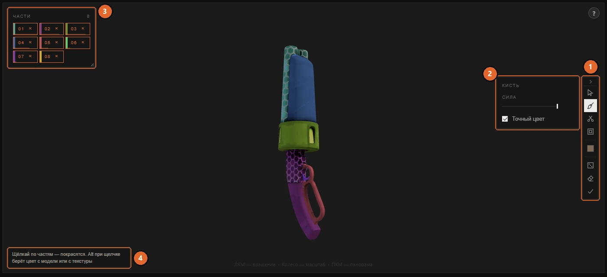

# Покраска по частям

[Документация](../README.md) · [English version](../en/model-parts.md)

У большинства оружия в TF2 один материал, а значит и одна текстура на всю модель. Покраска по частям позволяет покрасить ствол, не задевая приклад: она делит модель на куски, по которым можно щёлкать, и всё, что вы делаете с куском, ложится на его участок текстуры. Если куску нужен свой блеск, прозрачность или свечение, ему можно [дать собственный материал](#свой-материал-для-части).

На выходе получается обычная текстура, поэтому мод с покраской по частям ставится и работает как любой другой скин.

## Как включить

Нажмите **Разделить на части** под 3D-видом. Кнопка есть у моделей, которые приложение разбирает: у оружия, косметики, тел и рук классов. Работает она только в сцене **Модель** и не во время подгонки своей модели.

Можно и просто бросить картинку на модель. Приложение подсветит кусок под курсором, положит картинку на него и само включит режим частей.

Поверх 3D-вида появятся три вещи:

- **Колонка инструментов** у правого края: значки инструментов, текущий цвет и кнопки для всей работы целиком. Рядом с ней небольшая панель показывает настройки выбранного инструмента. Стрелка сверху сворачивает колонку.
- **Список частей** слева: по пронумерованной плашке на часть. При наведении на плашку её кусок подсвечивается на модели. Список можно двигать за заголовок, менять ему размер за правый нижний угол, а двойной щелчок по заголовку вернёт его на место.
- **Подсказка** внизу кадра, она говорит, что сделает текущий инструмент.

1. Колонка инструментов.
2. Настройки выбранного инструмента, здесь кисти.
3. Список частей.
4. Подсказка.

## Что считается частью

Частью считается связный кусок геометрии: барабан револьвера, его рамка, ствол. Так модель видит человек, и список получается коротким: у револьвера 29 таких кусков против 106 островов развёртки.

Номера плашек привязаны к местам на модели. Если разрезать кусок 04 на мелкие, они станут `04·1`, `04·2` и так далее, и видно, откуда они взялись. Размер плашки отражает, сколько места часть занимает в текстуре, а точную долю показывает подсказка.

**Части с общим участком текстуры.** Иногда несколько кусков пользуются одним и тем же участком текстуры. Чаще всего это левая и правая половины симметричной модели: художник отзеркалил их, чтобы сэкономить место. В игре у них одни и те же пиксели, выглядеть по-разному они не могут, и покраска одной красит и другую. Такие плашки помечены, и об этом сказано в их подсказке. По той же причине приложение режет обе половины вместе.

Если модель сделана одним цельным куском, делить нечего, и подсказка так и скажет.

## Инструменты

| Инструмент | Что делает щелчок по части |
|---|---|
| Картинка (значок курсора) | Кладёт на часть картинку. Щёлкните по части, чтобы выбрать файл, или перетащите картинку прямо на неё. |
| Кисть | Красит часть текущим цветом или градиентом. |
| Ножницы | Выделяют участки поверхности, чтобы разрезать часть мельче. См. [Как резать части мельче](#как-резать-части-мельче). |
| Окантовка | Обводит линией края частей, которые вы красите. |
| Материал (значок шара) | Переносит часть в собственный материал или обратно. См. [Свой материал для части](#свой-материал-для-части). |
| Квадрат цвета | Открывает выбор цвета. Второй квадрат появляется, когда включён градиент. |
| Кубик | Красит все части в случайные цвета. Потом можно щёлкать по частям и поправлять то, что не понравилось. |
| Ластик | **Убрать всё**: снимает с частей все цвета, картинки и окантовку. <kbd>Ctrl</kbd>+<kbd>Z</kbd> вернёт обратно. |
| Галочка | **Готово**: выход из режима частей. Сделанное остаётся. |

Когда режим открывается, ни один инструмент не выбран, поэтому первый щелчок по модели ничего случайно не покрасит.

## Покраска цветом

Возьмите кисть, выберите цвет в квадрате и щёлкайте по частям на модели или по плашкам в списке.

| Настройка | Что делает |
|---|---|
| **Сила** | Насколько сильно цвет перекрывает исходную текстуру, от 20 до 100 процентов. |
| **Точный цвет** | Включено (по умолчанию): цвет ложится ровно как в палитре, а фактура текстуры остаётся за счёт её собственных светов и теней. Выключено: цвет смешивается с оригиналом по его яркости. На потёртом металле так выходит естественнее, но цвет уже отличается от выбранного в палитре. |

**Градиент.** В окне выбора цвета кнопка **Градиент** переключает кисть на переход из первого цвета во второй. Полоса показывает, как переход ляжет на часть: квадратики по краям отмечают, где каждый цвет чистый (чем они ближе друг к другу, тем резче переход), а ромбик отмечает середину. Щелчок по квадратику позволяет править его цвет. Круглая ручка задаёт направление: тяните её мышью или нажимайте стрелки. Наклонный переход на плоской детали как раз и читается как объём.

**Пипетка.** Кнопка пипетки в окне выбора цвета берёт цвет с модели или с текстуры слева. Зажмите кнопку мыши: цвет под курсором виден, пока вы его ведёте, а берётся там, где вы отпустите. С кистью в руке то же самое делает <kbd>Alt</kbd>+щелчок, без открытия палитры.

У части может быть одновременно и цвет, и картинка. Цвет тогда лежит под картинкой.

## Картинка на части

Возьмите инструмент картинки и щёлкните по части, чтобы выбрать файл, или просто перетащите файл картинки на часть модели. Картинка впишется в участок текстуры этой части.

У плашки с картинкой появляется кнопка **…** (с числом, если картинок несколько). Она открывает окно посадки. **×** на плашке снимает с части всё, что вы с ней сделали, и возвращает ей игровую текстуру.

### Окно посадки картинки

Окно показывает настоящий участок части на текстуре: треугольники её острова развёртки, а не прямоугольную рамку вокруг них. Всё, что выйдет за эти треугольники, при сборке обрежется, так что здесь вы видите ровно то, что получится.

| Область | Что там |
|---|---|
| **Слои** (слева) | Картинки этой части. Верхняя строка лежит поверх остальных, строки можно перетаскивать. **+ Добавить** кладёт ещё одну картинку поверх, **Заменить…** меняет файл и сохраняет посадку, **Убрать** снимает картинку. **Копировать** и **Вставить** переносят картинку вместе с посадкой между частями. |
| Холст (в середине) | Тяните картинку, чтобы двигать её. Квадратики по краям меняют размер, а если перетянуть край дальше противоположного, картинка отразится. Поворачивает круглый маркер или стрелки на клавиатуре. Колесо приближает. |
| **Показ** (под холстом) | **Приблизить** придвигает холст к части, это выручает на мелких деталях. **Без игровой** прячет оригинал, чтобы были лучше видны края вашей картинки. **Сетка** показывает треугольники части вместо её контура. |
| Свойства (справа) | Та же посадка в числах. **Вписать**: **Целиком** вписывает картинку в участок с сохранением пропорций, **Заполнить** покрывает участок целиком, а края уходят под маску, **Растянуть** заполняет без сохранения пропорций. **Размер, %** по ширине и высоте (минус отражает картинку). **Поворот, °**. **Сдвиг, % места** вправо и вниз. **Сбросить посадку** возвращает исходное положение. |

**Готово** применяет изменения, **Отмена** их отбрасывает.

**Копирование на другие части.** <kbd>Ctrl</kbd>+<kbd>C</kbd> в окне посадки копирует картинку вместе с её размером на текстуре. Затем наведите курсор на другую часть модели и нажмите <kbd>Ctrl</kbd>+<kbd>V</kbd>: картинка ляжет туда того же размера, новым слоем. Так быстрее всего положить один логотип на несколько деталей.

### Анимированные картинки

GIF на части становится в моде анимированной текстурой: сборка запекает все кадры. В превью анимация крутится, только если включены **Настройки → Крутить гифки на модели**. По умолчанию это выключено: каждый мазок пересчитывает кадры, на что уходят секунды, и держит их в видеопамяти, а это бывает и сотни мегабайт.

## Как резать части мельче

Автоматическое деление не всегда совпадает с тем, что хочется покрасить. Рука Шпиона, например, состоит из одного куска геометрии, а покрасить хочется пальцы. Для этого есть ножницы.

Возьмите ножницы и выберите способ выделения:

| Способ | Как выделяет |
|---|---|
| **Деталь** | Щелчок берёт гладкую поверхность до острых рёбер. **Острота рёбер** задаёт порог: при меньших значениях деталь дробится на отдельные грани, при больших берутся крупные участки. |
| **Кисть** | Ведите по модели с зажатой кнопкой, и выделится всё под кистью. **Размер кисти** задаёт радиус, вплоть до треугольников прямо под курсором: кисть всегда берёт целые треугольники модели, поэтому на грубой сетке даже самый малый размер берёт крупный кусок. **Стирать** убирает из выделения. Если вести мимо модели, камера по-прежнему вращается. |
| **Остров** | Щелчок берёт остров развёртки целиком. |

Панель показывает, сколько треугольников выделено. **Отделить** (или <kbd>Enter</kbd>) превращает выделенное в новую часть, **Сбросить** (или <kbd>Esc</kbd>) снимает выделение.

**Как объединить части.** Пока выбраны ножницы, щелчок по плашке выделяет часть целиком. Выделите так две части и нажмите **Отделить**: они станут одной.

Ползунок **Нарезать по островам** режет все куски по островам развёртки разом. Чем дальше его сдвинуть, тем мельче нарезка.

У отрезанной части на плашке есть кнопка **−**, она возвращает часть в кусок, из которого её вырезали. <kbd>Ctrl</kbd>+<kbd>Z</kbd> тоже работает.

## Окантовка

Окантовка обводит линией края частей, которые вы красите. Нажмите **Обводить**, выберите цвет и задайте **Толщину**. С этого момента каждая покрашенная часть получит обводку. Это быстрый способ сделать мультяшный вид или разделить части, покрашенные в похожие цвета.

## Свой материал для части

Покраска меняет пиксели, а пикселями не сделать ствол блестящим, а приклад матовым. Блеск, прозрачность и свечение задаёт VMT материала, и он у всей модели один. Инструмент **Материал** (значок шара) переносит части в отдельный материал модели со своим VMT, картами материала и настройками текстуры.

Возьмите инструмент и щёлкайте по частям на модели или по плашкам в списке. Панель рядом с колонкой показывает, куда они уйдут. Пока выбран **Новый материал**, первый щелчок создаёт материал, а следующие добавляют части в него же. Чтобы добавить части в материал, заведённый раньше, выберите его в списке. Щелчок по части, которая уже лежит в выбранном материале, возвращает её в общий, а **×** рядом с материалом возвращает все его части. На плашках таких частей в углу стоит номер материала.

То же самое можно сделать, не меняя инструмент: щёлкните по плашке правой кнопкой и выберите **В новый материал**, **В материал «…»** или **Вернуть в общий**.

Новый материал появляется в альбоме карточкой рядом с исходным, с именем вроде `c_scattergun_part1`. Это отдельный материал, как голова и тело у класса: картинка, положенная на карточку исходного, до него не доходит. В момент создания он получает копию того, что есть у исходного: его своей картинки (или игровой текстуры, если своей нет), правки VMT, карт материала и настроек текстуры, поэтому часть выглядит как раньше. Дальше они живут порознь. На карточке части давайте ей свою картинку, правьте её VMT, добавляйте [карты материала](materials.md) и меняйте настройки текстуры. Цвета и картинки, которые кладут на части остальные инструменты, видны на части в любом её материале. Краска ложится только в текстуру материала этой части: если развёртки частей разных материалов накрывают одно место текстуры (например, зеркальные половины), краска одной на другую не попадает. В 3D каждый материал рисуется своей текстурой, и в режиме частей тоже.

При сборке треугольники части получают в модели имя нового материала, а сам материал встаёт во все скины модели. В каждом скине его VMT начинается с игрового VMT материала, стоящего на том же месте, а ваши правки VMT ложатся сверху. Своя картинка уходит в скины своей команды: картинка RED в красные, картинка BLU в синие. В остальных скинах, например Australium и стилях, у части игровая текстура этого скина. Часть без своей картинки получает в моде только VMT: он ссылается на игровую текстуру, а она в игре и так есть.

Свой материал бывает у частей игровой модели и у частей своей модели. Его нет у мода из VPK, у праздничной гирлянды и у Dead Ringer, чьё превью показывает не ту модель, что идёт в мод. У косметики с отдельной моделью для каждого класса части переносятся на модели остальных классов по участку текстуры, который они занимают: текстура у классов общая. Если на модели класса часть по текстуре не отличить (зеркальные половины делят один участок), этот класс остаётся с цельным материалом, и сборка об этом предупредит. У косметики со стилями он собирается для стиля, открытого при сборке.

Если игра обновит модель и её треугольники изменятся, сборка пропустит материал части и скажет об этом в итоге, а не перенесёт чужие треугольники.

## Команды, стили и состояния модели

Части красят ту карточку, которую показывает превью. При включённом **BLU** вы красите синюю текстуру, при включённом **Australium** золотую, при выбранном стиле текстуру этого стиля. У каждой из них свои мазки.

Части работают с основным состоянием модели. Если **Состояние модели** переключено на разбитую бутылку или взорванный Кабер, перед покраской верните его обратно. [Снаряд в оружии](custom-models.md#снаряд-в-оружии) для покраски тоже должен быть виден: его части идут в списке после частей самого оружия.

## Отмена и сохранение

Всё, что вы делаете в режиме частей, попадает в общую историю предмета: <kbd>Ctrl</kbd>+<kbd>Z</kbd> отменяет последний шаг, <kbd>Ctrl</kbd>+<kbd>Y</kbd> возвращает его. Работа сохраняется в черновик предмета вместе со всем остальным, а следующая сборка запекает её в текстуру в выбранном разрешении.

Загрузка своей модели сбрасывает части вместе с их собственными материалами: у неё другие треугольники, и прежнее деление к ней не подходит.

## См. также

- [War Paint](war-paint.md): нарезанные части служат и целями для узоров War Paint.
- [Первый скин](reskin.md): общий порядок покраски и сборки.
