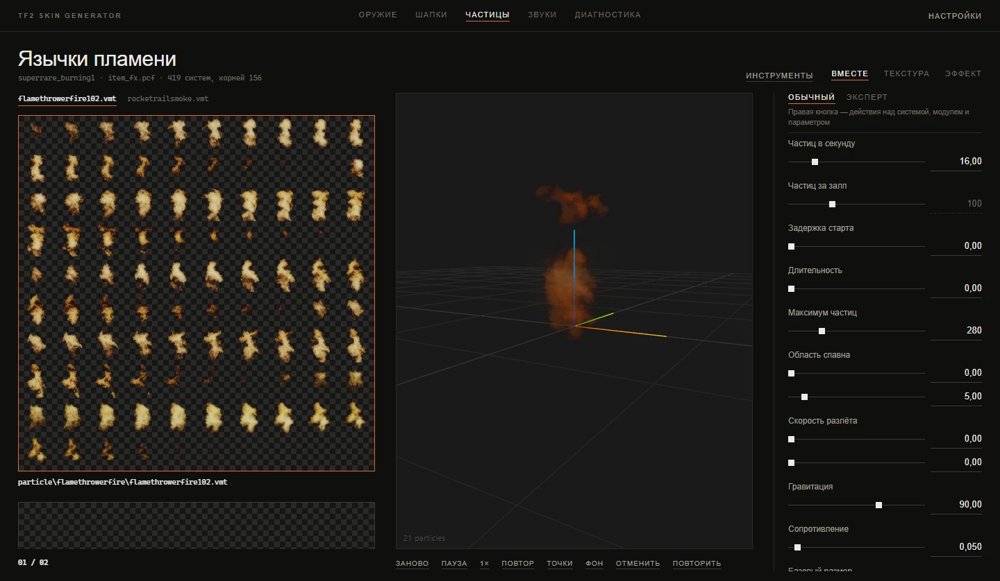

# Редактор частиц

[Документация](../README.md) · [English version](../en/particles.md)

Раздел **Частицы** правит эффекты частиц игры: необычные эффекты (анюжуалы), взрывы, вспышки выстрелов, эффекты построек, атмосферу карт. Эффекты лежат в игре в файлах PCF, и в каждом файле много систем. Редактор открывает PCF, показывает его системы деревом, проигрывает выбранный эффект в превью так, как это сделала бы игра, и собирает мод с вашим изменённым файлом.

## Как найти эффект

Каталог этого раздела работает в двух режимах, их переключает список **Показать** вверху:

- **Все эффекты игры** показывают каталог эффектов по именам. С него и стоит начинать.
- Имя файла (например, `class_fx.pcf`) открывает этот файл и показывает дерево его систем.

**Поиск** находит эффекты по игровым названиям и по именам систем. Необычные эффекты подписаны так, как их знают игроки: запрос `Burning Flames` найдёт систему `superrare_burning1`. Пока после запуска приложение ещё составляет список эффектов, поиск идёт только по названиям из игры, и об этом появится пометка.

**Источник** сужает список по тому, что вызывает эффект: **Оружие**, **Постройки**, **Игрок**, **Попадания и взрывы**, **Анюжуалы**, **Насмешки**, **Хэллоуин**, **MvM**, **Режимы и правила**, **Карты и окружение**. На каждой кнопке видно, сколько эффектов под ней.

Щелчок по эффекту открывает его файл и выбирает систему. В заголовке появятся игровое название, имя системы, файл и число систем в нём.

## Дерево систем

Внутри открытого файла системы показаны деревом: дочерняя система стоит под родительской, а треугольник сворачивает детей. Если выключить **Настройки → Группировать дерево частиц**, список станет плоским.

Система, которая отличается от игровой, помечена **Изменена относительно игры**, а система, которой нет в игре, помечена **Нет в игре**.

Правый щелчок по системе открывает её меню:

| Пункт | Что делает |
|---|---|
| **Копировать все параметры системы** | Кладёт всю систему в буфер обмена в виде JSON. То же делает <kbd>Ctrl</kbd>+<kbd>C</kbd>. |
| **Вставить параметры** | Вставляет скопированный набор. См. [Копирование и вставка](#копирование-и-вставка-параметров). То же делает <kbd>Ctrl</kbd>+<kbd>V</kbd>. |
| **Добавить слой со своей текстурой…** | Добавляет новую дочернюю систему, чтобы нарисовать поверх эффекта свою текстуру. |
| **Переименовать систему…**, **Дублировать систему…** | Переименовать или скопировать систему внутри файла. |
| **Добавить дочернюю…** | Подцепляет другую систему файла как дочернюю (**Подцепить существующую…**) или отцепляет её (**Отцепить…**). |
| **Цвета текстуры (снять подкраску)** | Удаляет модули цвета у системы и её детей и делает базовый цвет белым, чтобы текстуры показывали родные цвета. |
| **Вернуть как в игре** | Заменяет все правки системы (параметры, модули, детей) игровой версией. |
| **Удалить систему** | Удаляет систему из файла. |

## Правка параметров

Панель справа показывает выбранную систему в одном из двух режимов.

### Обычный

Главное в виде ползунков, у каждого короткое пояснение: **Частиц в секунду**, **Частиц за залп**, **Задержка старта**, **Длительность**, **Максимум частиц**, **Область спавна**, **Скорость разлёта**, **Гравитация**, **Сопротивление**, **Базовый размер**, **Разброс размера**, **Рост размера**, **Время жизни**, **Прозрачность**, **Появление**, **Исчезание**, **Цвета частиц**, **Вращение**. Изменения сразу видны в превью.

Некоторым ползункам нужен модуль, которого в системе пока нет. Где это безопасно, редактор добавит модуль сам. Эмиттер он не добавит, потому что второй эмиттер задвоит залп; если он действительно нужен, добавьте его в экспертном режиме.

### Эксперт

Вся система так, как она хранится в файле: группы, модули в них и все атрибуты каждого модуля. Параметров у системы бывает под две сотни, поэтому пользуйтесь **Поиском параметра**: он отбирает по именам атрибутов и модулей, например `radius`.

Шесть групп модулей:

| Группа | Что делают её модули |
|---|---|
| **operators** | Что происходит с частицей по ходу жизни |
| **initializers** | Какой частица рождается |
| **renderers** | Чем она рисуется |
| **emitters** | Как выпускаются частицы |
| **forces** | Что на них давит |
| **constraints** | Что их ограничивает |

Структуру меняют правым щелчком:

| Где | Меню |
|---|---|
| Заголовок группы | **Добавить модуль…** (сверху ходовые модули, ниже всё, что встречается в эффектах игры), **Копировать группу «…»** |
| Имя модуля | **Добавить параметр…** (только те параметры, которых в модуле ещё нет, со значением, которое используют эффекты игры), **Копировать этот модуль**, **Удалить модуль** |
| Параметр | **Копировать параметр «…»**, **Вернуть значение игры**, **Удалить параметр (вернуть умолчание)** |

Изменённые значения подсвечены, так что отличия от игры видны с первого взгляда.

### Копирование и вставка параметров

Любую часть системы (параметр, модуль, группу или всю систему) можно скопировать в виде JSON. Параметр, модуль или группа вставляются сразу, поверх совпадающих параметров. Если вставляется вся система, **Вставить параметры** спросит, как её применить:

- **Поверх**: совпадающие параметры заменить.
- **Без замены**: дописать только недостающее.
- **Полная замена**: убрать модули системы и поставить вставленные.

Если буфер обмена недоступен, откроется окно с текстом, чтобы скопировать или вставить его вручную.

## Превью

Эффект проигрывается в 3D-виде справа и моделируется так же, как в игре. Кнопки под кадром управляют проигрыванием:

| Кнопка | Клавиша | Что делает |
|---|---|---|
| **Заново** | <kbd>R</kbd> | Запускает эффект сначала. |
| **Пауза** / **Продолжить** | <kbd>Пробел</kbd> | Останавливает эффект. |
| **1×** | <kbd>S</kbd> | Переключает скорость времени: 1×, 0.5×, 0.25×. Вспышка крита длится полсекунды, и замедление помогает разглядеть, что в ней происходит. |
| **Повтор** | | Перезапускает эффект, когда он закончился. |
| **Точки** | | Открывает панель контрольных точек. |
| **Фон** | | Переключает тёмный, серый и светлый фон. Полупрозрачные слои вроде водяной дымки видны только на светлом. |
| **Отменить**, **Повторить** | <kbd>Ctrl</kbd>+<kbd>Z</kbd>, <kbd>Ctrl</kbd>+<kbd>Y</kbd> | Ходят по истории правок эффекта. |

<kbd>F11</kbd> разворачивает кадр на всё окно.

### Контрольные точки

В игре контрольные точки эффекта выставляет код: где оружие, куда летит снаряд, какого цвета отблеск килстрика. В превью их задаёте вы, в панели **Точки**:

- **Точка** выбирает контрольную точку. Панель подсказывает, какие точки эффект действительно использует.
- **Позиция** и **Углы** ставят её на место. Углы задают оси скорости и плоскость спрайтов.
- **Движение** оживляет точку: **Неподвижно**, **Покачивание вверх-вниз**, **Шаг вбок с подскоком**, **По кругу**, **Разворот на месте**, с **Амплитудой** и **Периодом, с**. Шлейфы и дым выглядят правильно, только когда их источник движется.
- **Модель…** ставит в сцену модель. В режиме **На модели** точка висит на одной из её **Точек крепления**, так же как необычный эффект висит на шапке: игра берёт крепление `unusual`, если оно есть у модели, а иначе первую кость, общую с моделью игрока.

Выбор модели использует тот же каталог, что и другие разделы. Модели, которые вы уже открывали, приходят из кэша сразу, остальные сначала разбираются.

## Текстуры

Альбом показывает текстуры выбранного эффекта. Перетащите картинку на карточку, чтобы заменить текстуру, или щёлкните по ней правой кнопкой:

| Пункт | Что делает |
|---|---|
| **Своя картинка…** | Выбирает файл для этой текстуры. |
| **Игровая текстура из списка…** | Ставит другую текстуру, которая уже есть в эффектах игры. Такой мод работает в казуале (см. [ниже](#моды-частиц-и-казуал)). |
| **Разрешение своей картинки: N** | До какого размера приводится ваша картинка: до 1024, по умолчанию 512. Больше выглядит чётче вблизи, но мод становится тяжелее. |
| **Переименовать материал…** | Даёт материалу новый путь. |
| **Вернуть текстуру игры** | Снимает вашу замену. |

Некоторые текстуры устроены как анимированные листы из нескольких кадров, и карточка об этом говорит. Своя картинка заменит такую текстуру одним кадром, поэтому приложение сначала спросит.

## Меню инструментов

В этом разделе у **Инструментов** свои пункты:

| Пункт | Что делает |
|---|---|
| **Открыть PCF с диска…** | Открывает PCF не из игры, например из чужого мода. |
| **Сохранить PCF…** | Сохраняет открытый файл с вашими правками в папку экспорта. Доступен, когда файл открыт. |
| **Справочник параметров (JSON)…** | Сохраняет в папку экспорта справочник параметров модулей `particle_params.json`, вместе с материалами открытого файла. |
| **Справочник для ИИ (с заданием)…** | Тот же справочник с описанием задания внутри, его можно сразу отдать языковой модели. Набор параметров, который она вернёт, вставляется через **Вставить параметры**. |
| **Открыть папку экспорта** | Открывает папку экспорта. |

## Сборка мода частиц

**Собрать VPK** в этом разделе собирает эффект, а не текстуру. Перед сборкой приложение проверяет эффект на то, из-за чего мод молча не работает в игре: системы, которые стали невидимыми, эффект, спрятанный от камеры, ссылки на несуществующие системы, файлы в `tf/custom`, которые будут с ним конфликтовать. Если что-то найдено, окно **Проверка перед сборкой** покажет список. **Исправить (N) и собрать** чинит то, что чинится автоматически, **Собрать как есть** собирает без исправлений.

Потом приложение спросит имя файла. Результат попадёт в папку экспорта:

- `имя.vpk` содержит изменённый PCF и ваши текстуры.
- `имя_textures.vpk` появляется, если вы заменяли текстуры. В нём только текстуры, о нём следующий раздел.

Мод частиц заменяет файл PCF игры целиком. Два мода, которые меняют один и тот же файл, не складываются: побеждает тот, чьё имя идёт раньше по алфавиту (см. [установку модов](troubleshooting.md#как-установить-мод)).

## Моды частиц и казуал

На казуальных серверах пользовательские файлы частиц блокирует `sv_pure`. В локальной игре и на серверах, которые разрешают пользовательский контент, мод работает как есть.

Кто хочет свои частицы в казуале, пользуется [casual-pre-loader](https://github.com/cueki/casual-pre-loader), отдельной утилитой от сообщества. Приложение готовит для неё файлы двумя способами:

- **Лимит размера.** casual-pre-loader не загружает PCF больше оригинального. Приложение сжимает файл при сохранении и предупреждает, если он всё равно больше: **Собрано, но PCF на N Б больше оригинала — в казуале не загрузится**. Помогает удаление неиспользуемых систем.
- **Текстуры отдельным модом.** casual-pre-loader считает любой VPK с PCF внутри набором частиц и текстуры из него не ставит. Поэтому заменённые текстуры кладутся ещё и в `имя_textures.vpk`, который добавляют на вкладке аддонов этой утилиты.

Текстурам, выбранным через **Игровая текстура из списка…**, всё это не нужно: файл уже есть в игре.

## См. также

- [Настройки](settings.md): **Группировать дерево частиц**.
- [Установка модов и решение проблем](troubleshooting.md): куда класть VPK и как работает sv_pure.
