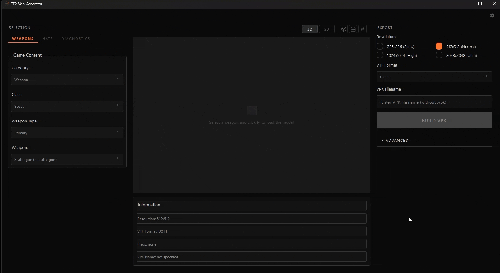

# Простые рескины

[← Оглавление документации](../README.md)

Рескин оставляет стоковую модель оружия и меняет только её **текстуру**. Это самый быстрый вид
мода и лучшая точка старта, если приложением ещё не пользовался.



## Перед началом

- TF2 должен быть установлен, а **папка игры** указана в Настройках (см.
  [главный README](../README.ru.md#первичная-настройка)).
- Подготовь текстуру в формате `PNG`, `JPG`, `TGA`, `BMP` или готовый `VTF`.
- Не знаешь, какого размера и какой раскладки рисовать? Сначала загрузи оружие, выгрузи из
  тулбара превью его **UV-шаблон** и рисуй поверх него.

## Шаги

1. **Выбери оружие.** В левой панели: **Категория → Оружие**, затем
   **Класс → Слот (Основное / Вторичное / Ближний бой) → Оружие**.

2. **Покажи оружие в 3D, опционально.** 3D-вид сам не загружается. Нажми **кнопку-куб**
   (*Load 3D model*) в тулбаре превью, чтобы отрисовать выбранное; 2D-вид при этом обновляется
   в любом случае сам. Кнопки тулбара, которые пригодятся на этом шаге:

   | Кнопка | Что делает |
   |--------|-----------|
   | **3D / 2D** | Переключение между 3D-моделью и плоским 2D-видом текстуры |
   | **Куб** (*Load 3D model*) | Отрисовывает текущее оружие в 3D, жми после выбора |
   | **VPK** | Загрузить готовый `.vpk`-мод в 3D-вид |
   | **Замена модели** | Подставить свою модель (см. [Кастомные модели](custom-models.md)) |

3. **Загрузи текстуру.** Перетащи изображение в **главный слот текстуры** либо нажми Browse на
   самом слоте. Превью реагирует сразу.

   У некоторых моделей есть **доп. материалы**: линза прицела, гильза и т.д. Текстуры для них
   можно заранее загрузить в их карточки, а можно просто оставить и ответить на вопрос во время
   сборки (*Upload mine / Use game original / Use main texture*).

4. **Командные текстуры RED / BLU.**

   - Если у оружия уже есть отдельные командные скины в базовой игре, в тулбаре появляются
     переключатели **RED** и **BLU**. Переключись на **BLU** и загрузи вторую текстуру для синей
     команды.
   - Если нет, вместо них появится кнопка **`+`** (*сделать оружие командным*). Нажми её, и
     появятся переключатели RED/BLU: синий материал приложение соберёт само при сборке. Оставь
     BLU пустым, и обе команды получат RED-текстуру.
   - У некоторых видов оружия есть ещё тумблер **Australium/Gold** для золотого варианта и
     **кнопка-глаз**, открывающая скрытые служебные текстуры (глаза, свечение убера и т.п.).

5. **Задай параметры вывода** справа:

   | Параметр | Пояснение |
   |----------|-----------|
   | **Разрешение** | 256 / 512 / 1024 / 2048. Больше значит чётче, но и тяжелее файл. |
   | **Формат** | `DXT1` (без альфы) или `DXT5` (с альфой / прозрачностью). |
   | **VTF-флаги** | `Clamp S/T`, `No Mipmaps`, `No LOD`. Оставь по умолчанию, если не знаешь, зачем их менять. |
   | **Имя файла** | Имя выходного `.vpk`. |

6. **Собери.** Приложение сконвертирует текстуру в VTF, запишет VMT, упакует всё и положит
   `<имя>.vpk` в **папку экспорта** (`export/` по умолчанию).

## Установка мода в игру

1. Скопируй собранный `.vpk` в:
   ```
   …\Steam\steamapps\common\Team Fortress 2\tf\custom\
   ```
   (Создай папку `custom`, если её ещё нет.)
2. Перезапусти TF2. Именно полный перезапуск, а не `snd_restart`. Только он работает надёжно.
3. Возьми оружие и проверь его в лоадауте или на карте.

> **Удаление мода:** удали его `.vpk` из `tf\custom\` и перезапусти игру.

## Если что-то не так

- **Оружие выглядит стоковым, или розово-чёрная клетка.** VPK не в `tf\custom\`, либо пути
  внутри не совпадают с оружием. Пересобери и перекопируй.
- **Непонятно, почему не применяется?** Открой **Диагностику**, загрузи туда свой `.vpk`. Она
  подсветит типовые проблемы (нет `$basetexture`, неверные пути, битые VTF).
- **Серверы с `sv_pure`** часто блокируют клиентские скины в принципе. Проверяй на
  локальном сервере или там, где точно разрешены, прежде чем решать, что мод сломан.

## Дальше

- Хочешь заменить не только текстуру, но и саму модель? → [Кастомные модели](custom-models.md).
- Полный справочник опций → [Как пользоваться приложением](usage.md).
