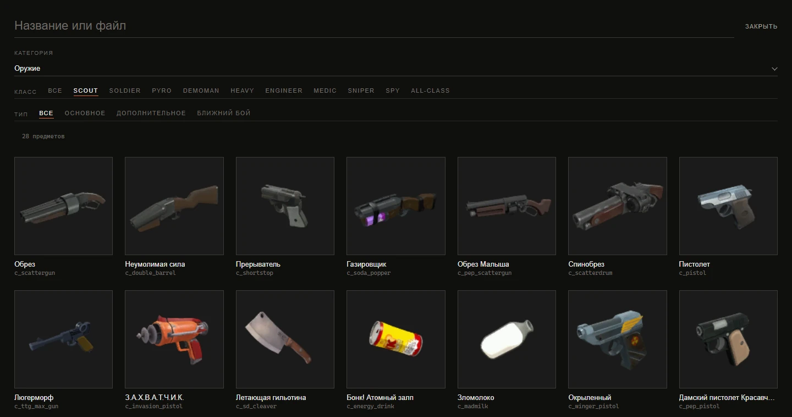
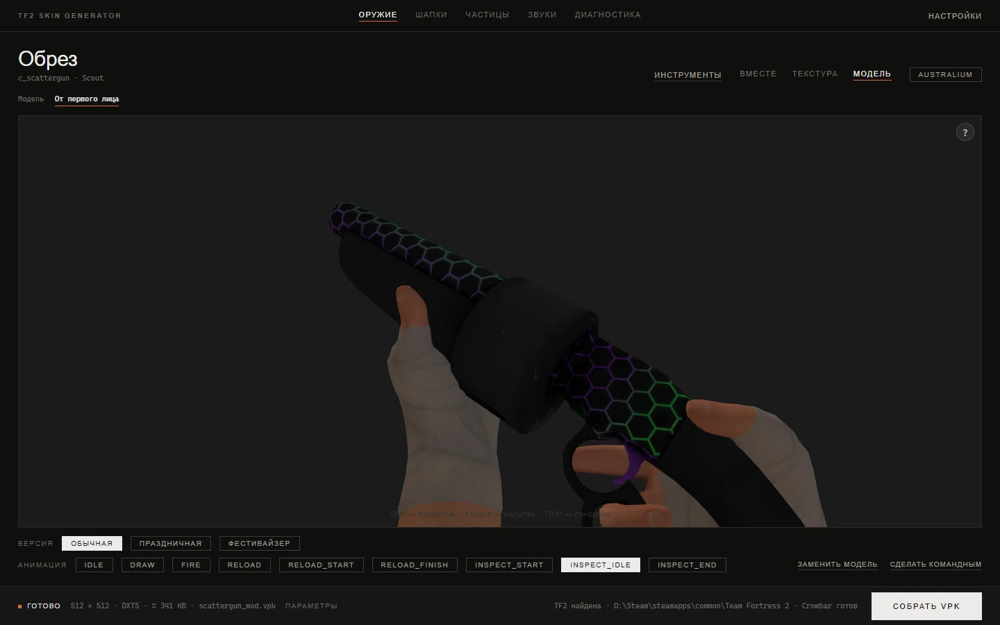
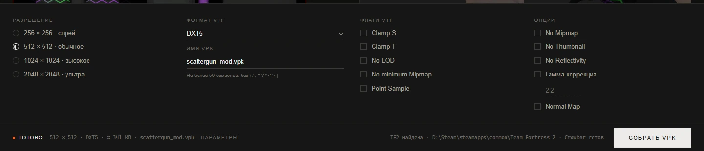

# Первый скин

[Документация](../README.md) · [English version](../en/reskin.md)

В этом гайде одно оружие проходит весь путь от каталога до игры. Для примера взят обрез Разведчика, но любое другое оружие делается так же, как и снаряды, аптечки и реквизит насмешек. Рескин оставляет игровую модель и меняет её текстуру. Это самый быстрый вид мода, и с него удобно начинать знакомство с приложением.

## Что понадобится

Понадобятся две вещи.

**Путь к игре.** При первом запуске приложение само находит TF2 или спрашивает папку. Где найдена игра, видно в нижней строке. Если там написано, что игра не найдена, откройте **Настройки** в правом верхнем углу и заполните **Папку игры** (ту, в которой лежат `tf` и `bin`) или нажмите **Найти автоматически**.

**Картинка.** Подойдут PNG, JPG, TGA, BMP, WEBP и GIF, а также готовый VTF. Размер может быть любым: перед сборкой приложение приведёт картинку к выбранному разрешению. Если нужна прозрачность, сохраните в файле альфа-канал.

Если вы ещё не знаете, как разложена текстура, сначала выберите оружие и сделайте **Инструменты → Экспорт UV-шаблона (PNG)**. Получится картинка с развёрткой модели, поверх которой удобно рисовать. **Инструменты → Извлечь оригинальную текстуру** сохраняет игровую текстуру, и с неё часто начинать ещё удобнее.

## 1. Выберите предмет

Нажмите на название предмета вверху окна. Пока ничего не выбрано, там написано **Выберите предмет**. Откроется каталог: строка поиска, список категорий и фильтры.



1. В списке **Категория** оставьте **Оружие**.
2. Сузьте список фильтрами **Класс** и **Тип** (основное, дополнительное, ближний бой, а у тех классов, где они есть, часы и КПК). Фильтры работают и по отдельности: **Тип → Ближний бой** без выбранного класса покажет всё оружие ближнего боя в игре.
3. Или наберите название в строке поиска. Каждое слово запроса должно найтись в названии оружия, в имени файла модели или в английском имени класса, порядок слов неважен. Поэтому и `обрез scout`, и `c_scattergun` находят обрез.
4. Щёлкните по карточке оружия.

Каталог закроется, и начнётся загрузка модели. Когда оружие открывается впервые, приложение достаёт модель из архивов игры и разбирает её через Crowbar. Это занимает несколько секунд. В следующий раз модель возьмётся из кэша почти мгновенно.

> [!TIP]
> Если каталог мешает, включите **Настройки → Закрепить панели**. Тогда каталог встанет слева, а параметры сборки справа, и вызывать их не придётся. Для этого окно должно быть шире 1100 пикселей.

## 2. Освойтесь с альбомом

В режиме **Вместе**, который включён по умолчанию, окно разделено на две половины: слева текстуры, справа 3D-модель. Кнопки **Вместе**, **Текстура** и **Модель** вверху переключают между обеими половинами и одной из них.

Левая половина называется альбомом. В нём по карточке на каждый материал модели. У большинства оружия один или два материала, у некоторых больше: отдельный прицел, гильзы, ремень. Листать карточки можно вкладками над альбомом, стрелками по бокам или колесом мыши. Счётчик под альбомом показывает, на какой вы карточке, например `02 / 03`.

3D-вид всегда показывает текстуру той карточки, на которой остановился альбом. Это важно у предметов, где несколько текстур делят одну сетку, например у масок маскировки Шпиона.

## 3. Положите свою картинку

Сделать это можно тремя способами.

- **Перетащить картинку на карточку.** Пока файл над карточкой, она подсвечивается.
- **Дважды щёлкнуть по карточке** и выбрать файл в окне.
- **Бросить картинку прямо на модель.** Приложение подсветит кусок под курсором, и картинка ляжет только на него. При этом включается покраска по частям, у неё есть [отдельный гайд](model-parts.md).

Превью обновляется сразу. Анимированный GIF становится анимированной текстурой: сборка превратит его кадры в многокадровый VTF и допишет в материал прокси анимации.

Чтобы заменить картинку на карточке, просто положите на неё другую. <kbd>Ctrl</kbd>+<kbd>Z</kbd> отменяет последние шаги, <kbd>Ctrl</kbd>+<kbd>Y</kbd> возвращает их. Чтобы вернуть предмету игровой вид целиком, нажмите **Забыть правки** под альбомом. Эта кнопка удаляет и сохранённый черновик предмета, так что используйте её, когда правда хотите начать с чистого листа (подробнее в гайде про [работы и черновики](works-and-mods.md)).

## 4. Командные цвета, Australium и другие варианты

Многие предметы выглядят у RED и BLU по-разному, а у некоторых есть ещё и дополнительные версии. Приложение показывает только те кнопки, которые имеют смысл для загруженной модели, поэтому у вас их может быть меньше, чем в этой таблице.

| Кнопка | Где | Что делает |
|---|---|---|
| **RED** / **BLU** | верхняя строка | Появляются, если у модели есть отдельные командные текстуры. Переключитесь на **BLU** и положите вторую картинку, чтобы у синих был свой вид. Если в игре синий вариант ничем не отличается от красного, об этом скажет подсказка у **BLU**. |
| **Сделать командным** | под моделью | Появляется, если у оружия в игре нет командного варианта. После нажатия появятся **RED** и **BLU**, а сборка добавит модели синий материал. Дайте BLU свою картинку или оставьте его пустым и ответьте **Скопировать главную**, когда сборка про него спросит. |
| **Australium** | верхняя строка | Появляется, если у оружия есть золотая версия. Пока кнопка включена, альбом показывает карточку австралия, и картинка на ней достанется только золотой версии. Если её не трогать, золотое оружие останется таким, как в игре. |
| **Прочее** | под альбомом | Показывает служебные материалы модели: глаза, зубы, оверлеи неуязвимости от убера, зомби-скины, блики-оверлеи. По умолчанию они спрятаны, потому что менять их нужно редко. |
| **Стиль** | под моделью | Дополнительные скины, заложенные в модель, например чистая и окровавленная версии некоторого оружия ближнего боя. **Базовый** означает основной скин. Пока у стиля нет своих текстур, он берёт базовые. |
| **Версия** | под моделью | **Обычная**, **Праздничная** и **Фестивайзер**: показывает гирлянду, которую игра вешает на это оружие. Перекрашенная или подогнанная гирлянда уходит в мод отдельной моделью и другое оружие не задевает. |
| **Состояние модели** | под моделью | Некоторые модели в игре меняются сами: бутылка разбивается, у Кабера после взрыва пропадает набалдашник. Эти кнопки позволяют посмотреть каждое состояние. Они меняют только превью, в мод уходят все состояния. |
| **Снаряд в оружии** | под моделью | У оружия, в которое заряжают снаряд (граната Подкидыша, ракета Ракетницы): **виден** или **скрыт**. Меняет только превью. Свою модель снаряду даёт **Заменить модель**, см. [Своя модель](custom-models.md#снаряд-в-оружии). |

Если у материала есть отдельные версии для RED и BLU, а картинка есть только у одной, сборка спросит, что делать со второй. Этот вопрос описан в [шаге 7](#7-соберите-мод).

## 5. Осмотрите модель со всех сторон

В 3D-виде обычное управление мышью:

| Действие | Мышь |
|---|---|
| Вращать | Левая кнопка, тянуть |
| Приблизить или отдалить | Колесо |
| Сдвинуть | Правая кнопка, тянуть |

Кнопки над моделью переключают сцену:

- **Модель** показывает сам предмет со свободной камерой.
- **От первого лица** кладёт оружие в руки его класса, так, как вы увидите его в игре. Под кадром появится ряд **Анимация** с анимациями, которые есть у этого оружия в игре: бездействие, доставание, выстрел, осмотр и другие. Включённая гирлянда видна и здесь.



<kbd>F11</kbd> разворачивает 3D-вид на всё окно, <kbd>F11</kbd> или <kbd>Esc</kbd> возвращают обратно.

## 6. Настройки сборки

В нижней строке видно, что получится на выходе: размер, формат VTF, примерный вес одной текстуры и имя файла. Кнопка **Параметры** открывает настройки сборки.



| Настройка | Что выбрать |
|---|---|
| **Разрешение** | 256, 512, 1024 или 2048 пикселей по стороне. По умолчанию 512. При 1024 текстура заметно чётче вблизи, 2048 оправдано для крупных и детальных предметов. Сводка внизу показывает цену: одна текстура DXT5 весит около 1,3 МБ при 1024 и около 5,3 МБ при 2048. |
| **Формат VTF** | `DXT1` сжатый и без прозрачности. `DXT5` сжатый и с альфа-каналом. `RGBA8888` без сжатия: лучшее качество при вчетверо большем весе. У большинства предметов в списке все форматы VTF, а у надписи крита и неба он сужен до тех, что там работают. |
| **Имя VPK** | Имя файла мода. Приложение подставляет его по предмету, например `scattergun_mod.vpk`, и перестаёт подставлять, как только вы напишете своё. Не больше 50 символов и без `\ / : * ? " < > \|`. |
| **Флаги VTF** и **Опции** | Не трогайте, если не знаете точно, зачем они нужны. Они описаны в [обзоре интерфейса](usage.md#настройки-сборки). |

**Свои настройки для одной текстуры.** В углу каждой карточки есть маленькая кнопка настроек с двумя ползунками. Она переводит панель сборки на этот материал: сверху появляется плашка с его именем, и всё, что вы меняете, относится только к нему. Пометка на карточке напоминает, что у материала свои настройки. **Готово** возвращает к общим настройкам, **Сбросить** убирает настройки материала. Пригодится, например, когда главной текстуре нужно 2048, а мелкой детали хватит и 512.

## 7. Соберите мод

Нажмите **Собрать VPK** в правом нижнем углу. Пока идёт сборка, на месте кнопки будет **Остановить**, а нижняя строка показывает каждый шаг. По дороге приложение может задать несколько вопросов:

| Вопрос | Когда появляется | Ответы |
|---|---|---|
| **Чем красить «материал»** | У материала нет вашей картинки. Сюда же относится синяя версия материала, если вы покрасили только RED. | **Оставить игровую**: материал не попадёт в мод, в игре останется стоковая текстура. **Скопировать главную**: на материал ляжет ваша главная текстура. **Выбрать файл…**: отдельная картинка. Галка **И так для остальных материалов** применит ответ ко всей сборке. Если закрыть окно, сборка отменится. |
| **Игра перекрасит предмет в …** | Материал берёт цвет из VMT там, где у текстуры белая альфа, а у вашей картинки альфы нет. В игре предмет целиком стал бы одного цвета. | **Как на картинке**: как в превью. **Убрать покраску из VMT**: то же, но параметры покраски ещё и удаляются из материала. **Покраска как в игре**: цвет ляжет только туда, где его кладёт игра у оригинала. **Собрать как есть**: покрасится весь предмет. |
| **Изменений нет** | Нет ни вашей картинки, ни правки VMT, ни карт материала, ни своей модели. | **Всё равно собрать** соберёт мод с игровым видом. Это бывает полезно, чтобы проверить пути. |
| **Своя модель для части «…»** | Только со [своей моделью](custom-models.md), если у оружия есть сменные состояния. | Оставить игровую часть или выбрать для неё SMD. |

Когда сборка закончится, внизу появится **VPK успешно создан** и полный путь к файлу. Если что-то требует внимания, ниже будут перечислены предупреждения. Файл лежит в папке экспорта, её открывает **Инструменты → Открыть папку экспорта**. У установленного приложения она находится в `%LOCALAPPDATA%\Tf2SkinGenerator\export`, если вы не выбрали в настройках другую папку.

Если сборка не удалась, откроется окно с объяснением понятными словами. В **Технических деталях** лежит исходное сообщение об ошибке, **Открыть журнал** открывает папку с `tf2sg.log`, а **Копировать** кладёт всё это в буфер обмена, чтобы приложить к сообщению об ошибке.

## 8. Установите мод и проверьте его

1. Скопируйте `.vpk` в папку `custom` игры:
   ```
   ...\Steam\steamapps\common\Team Fortress 2\tf\custom\
   ```
2. Полностью перезапустите TF2. Моды читаются при запуске игры, и уже запущенная игра их не подхватит.
3. Откройте снаряжение и посмотрите на оружие или зайдите в локальную игру.

Чтобы убрать мод, удалите его `.vpk` из `tf\custom` и перезапустите игру.

Проверять мод удобнее всего в локальной игре, например запущенной консольной командой `map ctf_2fort`: там ничто не блокирует пользовательские файлы. Если скин работает локально, но не работает на некоторых серверах, почитайте про [sv_pure](troubleshooting.md#казуал-и-sv_pure). Если он не работает нигде, откройте **Диагностику** и дайте приложению проверить файл (см. [решение проблем](troubleshooting.md#проверка-мода-диагностикой)).

## Что дальше

- [Покраска по частям](model-parts.md): покрасить только ствол, положить логотип на приклад, обвести края.
- [War Paint](war-paint.md): начать с игровой раскраски, а не с пустой текстуры.
- [Материалы и эффекты](materials.md): свечение, металлический блеск, отражения, прозрачность.
- [Своя модель](custom-models.md): поменять не только текстуру, но и форму оружия.
- [Обзор интерфейса](usage.md): всё, что умеет окно.
