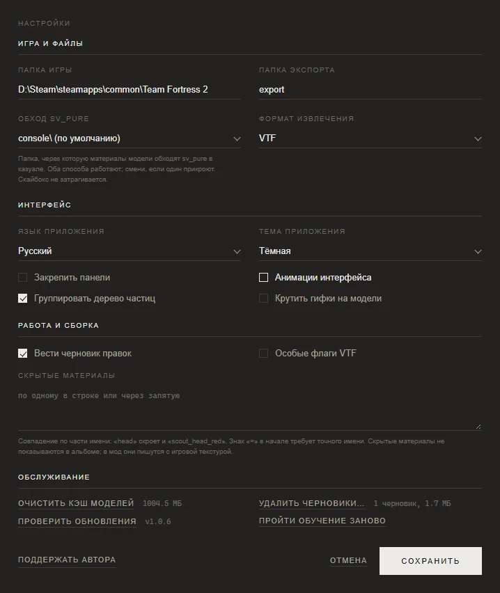

# Настройки и папки с данными

[Документация](../README.md) · [English version](../en/settings.md)

**Настройки** в правом верхнем углу открывают одно окно с четырьмя группами. Изменения вступают в силу по кнопке **Сохранить**, а **Отмена** закрывает окно без них. Здесь разобрана каждая настройка, а в конце рассказано, где приложение хранит ваши файлы.

## Игра и файлы

| Настройка | Что делает |
|---|---|
| **Папка игры** | Папка TF2, в которой лежат `tf` и `bin`, например `D:\Steam\steamapps\common\Team Fortress 2`. Значок папки открывает выбор папки. Пока путь не задан или неверен, под полем есть кнопка **Найти автоматически**: она ищет игру по записям Steam в реестре и по списку его библиотек на любых дисках. Путь считается верным, если в нём есть `bin\studiomdl.exe` и `tf\tf2_misc_dir.vpk`. |
| **Папка экспорта** | Куда кладутся собранные моды и извлечённые файлы. По умолчанию `export`. Относительный путь отсчитывается от папки данных приложения (см. [ниже](#где-приложение-хранит-ваши-файлы)), абсолютный используется как есть. |
| **Обход sv_pure** | Папка, в которую переносятся материалы модели, чтобы на казуальных серверах их пропустил `sv_pure`: `console\` (по умолчанию) или `vgui\replay\thumbnails\`. Работают оба, а переключатель нужен на случай, если одну из папок прикроют. Небо это не затрагивает. См. [решение проблем](troubleshooting.md#казуал-и-sv_pure). |
| **Формат извлечения** | Формат файла для **Инструменты → Извлечь оригинальную текстуру**: `VTF` (по умолчанию), `PNG`, `TGA` или `JPG`. На сборку не влияет, она всегда делает VTF. |

## Интерфейс

| Настройка | Что делает |
|---|---|
| **Язык приложения** | English или Русский. Окно перезагрузится на новом языке и вернётся в тот же раздел. Ваши правки и кэши останутся на месте. |
| **Тема приложения** | Тёмная (по умолчанию) или Светлая. |
| **Закрепить панели** | Держит каталог слева, а настройки сборки справа, вместо того чтобы вызывать их поверх окна. Нужно окно шире 1100 пикселей; в более узком настройка недоступна. |
| **Анимации интерфейса** | Плавное появление панелей, перелёт камеры к новой модели, разъезд половин. Если выключить, всё переключается мгновенно. |
| **Группировать дерево частиц** | Показывает системы файла частиц деревом, с детьми под родителями. Если выключить, список станет плоским. По умолчанию включено. |
| **Крутить гифки на модели** | GIF, положенный на часть модели, крутится и в 3D-виде. По умолчанию выключено: каждый мазок пересчитывает кадры, на что уходят секунды, и держит их в видеопамяти, а это бывает и сотни мегабайт. В мод анимация попадает в любом случае. |

## Работа и сборка

| Настройка | Что делает |
|---|---|
| **Вести черновик правок** | Молча записывает каждую правку предмета в черновик на диске. По умолчанию включено. Черновик возвращает кнопка **Вернуть правки**, а в раздел **Кастомный мод** работа попадает только через **Сохранить работу**. См. [Работы и черновики](works-and-mods.md). |
| **Особые флаги VTF** | Добавляет в настройки сборки колонку **Особые флаги** с флагами, которые цветной текстуре не нужны или могут ей навредить. По умолчанию выключено, и пока это так, эти флаги в сборку не попадают. См. [обзор интерфейса](usage.md#флаги-vtf). |
| **Скрытые материалы** | Материалы, которые нужно спрятать из альбома. См. ниже. |

### Скрытые материалы

Пишите по одному шаблону в строке или через запятую. Шаблон срабатывает на любой материал, в имени которого он встречается: `head` спрячет и `scout_head_red`. Если начать шаблон со знака `=`, нужно точное совпадение имени: `=scout_head_red` спрячет только этот материал.

Скрытые материалы не показываются в альбоме, а сборка без вопросов пишет их в мод с игровыми текстурами.

Часть материалов спрятана изначально, и здесь их не вернуть: глаза, зубы, языки, оверлеи убера, зомби-скины, оверлеи бликов. До них всё равно можно добраться кнопкой **Прочее** под альбомом.

## Обслуживание

| Пункт | Что делает |
|---|---|
| **Очистить кэш моделей** | Удаляет разобранные модели. Размер кэша написан рядом с кнопкой. После очистки первая сборка каждого предмета будет медленнее, потому что приложение разберёт его заново. Чистите кэш, если после обновления игры модели начали вести себя странно. |
| **Удалить черновики…** | Показывает черновики с размерами, чтобы удалить ненужные. Сохранённые работы в список не попадают и не трогаются. |
| **Проверить обновления** | Спрашивает GitHub, есть ли новая версия, и показывает текущую. См. [Обновления](#обновления). |
| **Пройти обучение заново** | Закрывает настройки и запускает обучение с самого начала. |
| **Хранить временные файлы при ошибке** | Оставляет временную папку сборки, если сборка не удалась, чтобы можно было посмотреть промежуточные файлы. Пригодится вместе с сообщением об ошибке. |
| **Отладочный режим** | Пишет в журнал подробные отладочные записи. Включите его, прежде чем повторять проблему, о которой собираетесь сообщить. |

**Поддержать автора** в левом нижнем углу открывает страницу обмена автора в Steam, если хочется сказать спасибо.

## Обновления

Когда вы первый раз за сеанс открываете настройки, приложение спрашивает у GitHub последний релиз, а **Проверить обновления** спрашивает заново в любой момент. Если вышла новая версия, об этом скажет надпись под кнопками, а сама кнопка поменяется:

- **Обновить** в установленном и портативном приложении. Приложение скачает установщик из релиза, сверит его размер и SHA-256 со значениями, которые публикует GitHub, и запустит его в тихом режиме. Приложение закроется, установщик заменит файлы программы и запустит новую версию. Ваши работы, моды и настройки не тронутся, потому что хранятся отдельно от программы. Портативная копия обновляется на месте, без ярлыков и деинсталлятора.
- **Открыть страницу релиза**, если приложение запущено из исходников. В этом случае обновляйтесь через git.

Пре-релизы и черновики релизов на GitHub не учитываются.

## Где приложение хранит ваши файлы

Файлы программы и ваши данные лежат в разных местах. Обновление полностью заменяет папку программы, поэтому ничего вашего там не хранится.

| Что | Установленное или портативное приложение | Запуск из исходников |
|---|---|---|
| Программа | по умолчанию `%LOCALAPPDATA%\Programs\Tf2SkinGenerator` или папка, куда вы распаковали архив | репозиторий |
| Ваши данные | `%LOCALAPPDATA%\Tf2SkinGenerator` | папка репозитория |
| Кэш разобранных моделей | `%USERPROFILE%\.tf2skingen_cache\decompiled` | там же |

Внутри папки данных:

| Папка или файл | Что внутри |
|---|---|
| `config\app_config.json` | Настройки. Удалите его (при закрытом приложении), чтобы вернуть всё по умолчанию. |
| `work\` | Черновики и сохранённые работы, по папке на предмет. |
| `mods\` | Библиотека открытых VPK-модов. |
| `export\` | Собранные моды и извлечённые файлы, если вы не выбрали другую папку экспорта. |
| `cache\` | Иконки из рюкзака, список косметики, профиль окна и прочее, что приложение может построить заново. |
| `tools\edited_vmt\` | Ваши правки VMT, по файлу на материал. |
| `tools\temp\` | Временные папки сборки. Остатки прерванных сборок удаляются при следующем запуске. |
| `tf2sg.log` | Журнал. При размере около 2 МБ он ротируется, и рядом хранятся два прошлых файла (`tf2sg.log.1`, `tf2sg.log.2`). |
| `tf2sg_crash.log` | Стеки нативных падений, если они когда-нибудь случались. |

Кэш моделей ограничен примерно 1 ГБ. Когда он вырастает больше, удаляются записи, которыми дольше всего не пользовались. Кроме того, записи пересобираются сами, когда игра обновляет свои архивы.

Ранние версии хранили данные рядом с программой. Первый запуск новой версии переносит `config`, `work`, `mods`, `export` и `cache` в папку данных, если их там ещё нет.

Одновременно может работать только одна копия приложения. Повторный запуск при открытом приложении ничего не делает: две копии, пишущие одни и те же настройки и черновики, затирали бы друг друга.

## См. также

- [Установка модов и решение проблем](troubleshooting.md)
- [Сборка из исходников](building-from-source.md): как устроена папка данных при запуске из кода.
