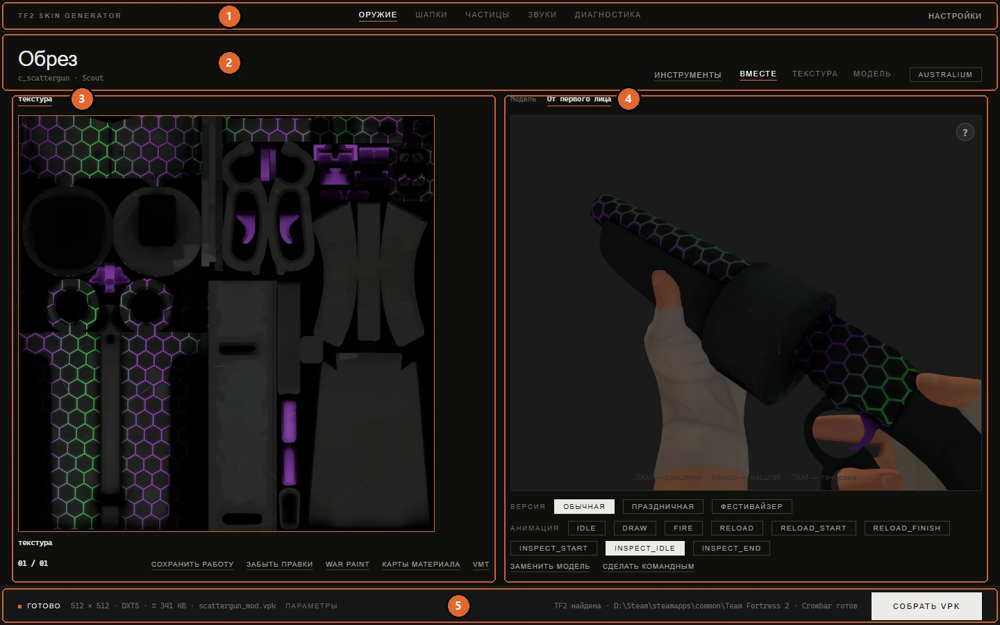

# Обзор интерфейса

[Документация](../README.md) · [English version](../en/usage.md)

Здесь окно разобрано по частям, и для каждой кнопки написано, что она делает. Если нужно просто сделать скин, короче будет путь через [«Первый скин»](reskin.md). Сюда стоит вернуться, когда захочется понять, зачем нужна конкретная кнопка.

Большинство кнопок появляется только тогда, когда они имеют смысл для выбранного предмета. У оружия без командного варианта нет **RED** и **BLU**, у неба нет **Заменить модель** и так далее. Если чего-то из этой страницы у вас на экране нет, выбранный предмет этого просто не поддерживает.

## Окно целиком

1. [Шапка окна](#шапка-окна): разделы и настройки.
2. [Строка заголовка](#строка-заголовка): выбранный предмет, инструменты, раскладка и командные кнопки.
3. [Альбом](#альбом): текстуры модели.
4. [Окно модели](#окно-модели): 3D-превью, сцены и действия над моделью.
5. [Нижняя строка](#нижняя-строка): состояние, сводка сборки и кнопка сборки.

Каталог и настройки сборки не занимают места, пока их не вызвали. Если включить **Настройки → Закрепить панели**, они останутся на экране: каталог слева, настройки сборки справа. Подробнее в разделе [Панели и раскладка](#панели-и-раскладка).

## Шапка окна

Ссылки наверху переключают разделы приложения.

| Раздел | Для чего |
|---|---|
| **Оружие** | Всё, что не косметика: оружие, тела и руки классов, особые эффекты, снаряды, аптечки и патроны, реквизит насмешек, небо и открытые VPK-моды. У каждого вида своя категория в каталоге. |
| **Шапки** | Шапки, прочая косметика и медали, со своим поиском и фильтрами. См. [Косметика](cosmetics.md). |
| **Частицы** | Редактор эффектов частиц. См. [Редактор частиц](particles.md). |
| **Звуки** | Замена звуков игры. См. [Звуки](sounds.md). |
| **Диагностика** | Открывает окно проверки собранного VPK. Текущий раздел при этом не меняется. См. [решение проблем](troubleshooting.md#проверка-мода-диагностикой). |

**Настройки** справа открывают окно настроек, оно описано в гайде [«Настройки и папки с данными»](settings.md).

Рядом с ними кнопки окна: свернуть, развернуть и закрыть. Шапка заодно служит заголовком окна: за любое пустое место в ней окно можно перетащить, двойной щелчок разворачивает окно или возвращает прежний размер, а правый щелчок открывает системное меню окна.

## Строка заголовка

**Название предмета.** Крупная надпись слева называет выбранный предмет, а рядом мелко написаны файл модели и класс. Щелчок по ней открывает каталог. Пока ничего не выбрано, там написано **Выберите предмет**.

**Инструменты** открывают меню действий над выбранным предметом. Набор пунктов зависит от раздела:

| Пункт | Что делает |
|---|---|
| **Извлечь модель (SMD)** | Разбирает модель предмета и показывает все файлы, которые выдал Crowbar: основную сетку, LOD, физику, анимации, QC. Основной SMD отмечен сразу, потому что это и есть геометрия. Отмеченные файлы копируются в папку экспорта. Пригодится как заготовка для [своей модели](custom-models.md). |
| **Экспорт UV-шаблона (PNG)** | Рисует развёртку модели в PNG 1024 × 1024 в папке экспорта, чтобы поверх неё было удобно рисовать. У каждого материала своя развёртка и свой файл. Шаблоны появляются и в альбоме, дополнительными карточками рядом с текстурами. |
| **Извлечь оригинальную текстуру** | Сохраняет игровую текстуру выбранного предмета в папку экспорта. У тел классов текстур пара десятков, поэтому сначала приложение спросит, какие нужны. Формат файла задаётся в **Настройки → Формат извлечения**. |
| **Собрать несколько VPK в один** | Объединяет моды из папки экспорта в один VPK. См. [объединение модов](works-and-mods.md#несколько-модов-в-одном-файле). |
| **Открыть папку экспорта** | Открывает папку экспорта в проводнике. Есть во всех разделах со строкой заголовка, то есть везде, кроме **Звуков**. |
| **Открыть PCF с диска…**, **Сохранить PCF…**, **Справочник параметров (JSON)…**, **Справочник для ИИ (с заданием)…** | Только в разделе частиц. См. [Редактор частиц](particles.md#меню-инструментов). |

Пункты извлечения и UV-шаблона появляются у всего, у чего есть модель. У неба, спрея, надписи крита и эффектов смерти модели нет, и там меню их не предлагает.

**Вместе, Текстура, Модель** меняют раскладку рабочей области: обе половины, только альбом или только 3D-вид. В разделе частиц последняя кнопка называется **Эффект**.

**Командные кнопки** стоят справа в строке заголовка:

| Кнопка | Когда появляется | Что делает |
|---|---|---|
| **RED**, **BLU** | У модели есть отдельные командные текстуры, или вы нажали **Сделать командным**. | Переключает альбом и превью на эту команду. Картинки ложатся на активную команду. |
| **Australium** | У оружия есть золотая версия. | Показывает золотую версию в альбоме и превью. |
| **Краска** | Только у косметики. | Открывает список игровых красок, чтобы посмотреть предмет покрашенным. Цветная точка на кнопке показывает выбранную краску. Краска нужна только для превью и в мод не попадает. См. [Косметика](cosmetics.md#краски-из-игры-в-превью). |

## Каталог

В каталоге выбирают, над чем работать. В обычной раскладке он открывается поверх окна по щелчку на названии предмета и закрывается, когда предмет выбран. <kbd>Esc</kbd> или **Закрыть** прячут его без выбора.

**Поиск.** Строка сверху (**Название или файл**) ищет по мере ввода. Каждое слово запроса должно найтись в названии, имени файла модели или английском имени класса, порядок слов неважен. В разделе шапок поиск умнее: он сортирует результаты по похожести, при русском интерфейсе ищет и по английским названиям, а если ничего не нашёл, предлагает похожие имена.

**Категория** (только в разделе «Оружие»):

| Категория | Что внутри | Фильтры |
|---|---|---|
| **Оружие** | Оружие всех классов, по карточке на модель, включая общее оружие ближнего боя и праздничное оружие со своей моделью | **Класс**, **Тип** |
| **Персонаж** | Тело каждого класса (**Скин персонажа**) и руки от первого лица. У Шпиона есть ещё **Маски маскировки**, у Инженера **Рука робота (МвМ)** | **Класс** |
| **Специальное** | **Крит**, **Спрей**, **Эффект смерти: Лёд**, **Эффект смерти: Золото**, **Эффект смерти: Огонь** | нет |
| **Снаряды** | Ракеты, гранаты, липучки, стрелы, сигнальные заряды и другие снаряды | нет |
| **Аптечки и патроны** | Аптечки и коробки с патронами, включая версии для Хэллоуина и дня рождения TF2 | нет |
| **Реквизит насмешек** | Предметы, которые появляются в насмешках | нет |
| **Скайбокс** | **Все карты (все стоковые скайбоксы)** и каждое небо, найденное в вашей игре | нет |
| **Кастомный мод** | Ваши сохранённые работы и открытые VPK-моды | нет |

Персонажи, особые эффекты и небо описаны в [отдельном гайде](special-items.md), а библиотека **Кастомного мода** в гайде [«Работы, черновики и библиотека модов»](works-and-mods.md).

**Фильтры** выглядят как ряды кнопок под категорией. **Все** снимает фильтр. Под фильтрами написано, сколько предметов показано, так что видно, сузил фильтр список или нет.

**Карточки** показывают иконку предмета из рюкзака, если она есть в игре, а если нет, текстуру самой модели. Строка под названием показывает файл модели, а у косметики класс. У косметики с несколькими модельными стилями на карточке есть пометка вроде «3 стиля».

## Альбом

Левая половина рабочей области показывает текстуры модели, по карточке на материал.

**Перемещение по карточкам:** вкладки над альбомом, стрелки по бокам, колесо мыши или щелчок по карточке. Счётчик в левом нижнем углу показывает позицию, например `02 / 03`. 3D-вид всегда показывает текстуру той карточки, на которой стоит альбом. Это важно у моделей, где несколько текстур делят одну сетку, как у масок Шпиона.

**Как положить картинку:** перетащите её на карточку или дважды щёлкните по карточке и выберите файл. Подходят картинки и VTF. GIF и анимированный PNG становятся анимированными текстурами.

**Кнопки на карточке** появляются в её углу:

| Кнопка | Что делает |
|---|---|
| Настройки (два ползунка) | Даёт материалу своё разрешение, формат и флаги. См. [свои настройки текстуры](#свои-настройки-текстуры). |
| **×** | Только на карточке стиля: убирает материал из стиля, и он снова берёт базовую текстуру. |

**Кнопки под альбомом:**

| Кнопка | Когда появляется | Что делает |
|---|---|---|
| **Сохранить работу** | У предмета есть правки, которые ещё не сохранены как работа. | Кладёт работу в раздел **Кастомный мод**, откуда её можно открыть позже. |
| **Вернуть правки** | У предмета есть черновик с прошлого раза, а в этот раз ещё ничего не изменено. | Возвращает черновик. |
| **Забыть правки** / **Удалить работу** | У предмета есть правки или сохранённая работа. | Возвращает предмету игровой вид и удаляет черновик или работу с диска. |
| **War Paint** | Оружие, которое держат в руках. | Открывает панель War Paint. См. [War Paint](war-paint.md). |
| **Карты материала** | Всё, у чего есть модель. | Блеск, свечение, маска отражений и другие карты для текущего материала. См. [Материалы и эффекты](materials.md#карты-материала). |
| **VMT** | Модели, кроме открытых VPK-модов. | Открывает редактор VMT текущего материала. См. [Материалы и эффекты](materials.md#редактор-vmt). |
| **Прочее** | У модели есть служебные материалы. | Показывает их карточками: глаза, зубы, оверлеи убера и тому подобное. |

Как устроены работы и черновики, рассказано в гайде [«Работы, черновики и библиотека модов»](works-and-mods.md).

**Полоса стиля.** Когда в ряду **Стиль** выбран текстурный стиль, отличный от базового, под альбомом появляется строка с пояснением. Стиль меняет базу выборочно: в альбоме только те материалы, которые стиль меняет, остальные берутся из базы. **Добавить материал** добавляет в стиль ещё один материал, чтобы дать ему свою текстуру.

## Окно модели

Правая половина показывает предмет в 3D.

| Действие | Мышь |
|---|---|
| Вращать | Левая кнопка, тянуть |
| Приблизить или отдалить | Колесо |
| Сдвинуть | Правая кнопка, тянуть |

<kbd>F11</kbd> разворачивает 3D-вид на всё окно, <kbd>F11</kbd> или <kbd>Esc</kbd> возвращают интерфейс.

### Сцены

Кнопки над 3D-видом выбирают, что в нём показано.

| Сцена | Для чего есть | Что видно |
|---|---|---|
| **Модель** | для всего | Сам предмет со свободной камерой. |
| **От первого лица** | оружие, которое держат в руках | Оружие в руках его класса глазами игрока, с анимациями этого оружия. |
| **Насмешка** | реквизит насмешек | Класс исполняет насмешку с реквизитом. |
| **На модели** | косметика | Косметика на классе, который стоит в позе выбранного слота оружия. |

В первый раз сцена собирается несколько секунд. **Насмешка** и **На модели** для нового класса могут собираться до полуминуты: приложение распаковывает анимации этого класса. Использованные анимации оно хранит отдельно, и дальше эти сцены открываются за пару секунд, в том числе после перезапуска. Анимации внутри сцены переключаются быстро: приложение берёт уже готовые сетку и текстуры.

### Ряды под кадром

Эти ряды появляются, когда у предмета есть из чего выбирать:

| Ряд | Что делает |
|---|---|
| **Стиль** | Скины, заложенные в модель (чистая и окровавленная версии и похожие). **Базовый** означает основной скин. |
| **Состояние модели** | Состояния, которые игра переключает сама, например целая и разбитая бутылка. Только для просмотра, в мод уходят все состояния. |
| **Версия** | **Обычная**, **Праздничная**, **Фестивайзер**: показывает гирлянду, которую игра вешает на оружие. Со своей моделью появляется **Подогнать гирлянду**, чтобы перенести огоньки на вашу геометрию. См. [праздничное оружие](custom-models.md#праздничное-оружие-и-гирлянды). |
| **Стиль шапки** | Модельные стили косметики. У каждого своя геометрия, а точка отмечает стили, которые вы правили. |
| **Анимация** | В сцене **От первого лица**: анимации этого оружия. |
| **Оружие** | В сцене **На модели**: какой слот у класса в руках. От него же зависит поза. |
| **Класс** | В сценах **Насмешка** и **На модели**: какой класс показывать, если предмет подходит нескольким. |

### Действия над моделью

Кнопки справа под 3D-видом работают с самой моделью:

| Кнопка | Когда появляется | Что делает |
|---|---|---|
| **Заменить модель** | Всё, у чего есть модель, кроме тел классов | Загружает ваш SMD, OBJ, GLB или glTF вместо игровой модели. См. [Своя модель](custom-models.md). |
| **Масштабировать** | Загружена своя модель | Показывает полупрозрачную копию оригинала и даёт сдвинуть, повернуть и отмасштабировать вашу модель так, чтобы она совпала с ним. |
| **Редактировать QC** | Своя модель загружена со своими материалами и костями | Открывает скрипт компиляции модели. |
| **Сделать командным** | У предмета нет командного варианта, и его можно добавить | Добавляет версии для RED и BLU. |
| **Разделить на части** | Модели, которые приложение разбирает: оружие, косметика, тела, руки | Включает покраску по частям. См. [Покраска по частям](model-parts.md). |
| **Убрать свою модель** | Стоит ваша модель или ваша гирлянда | Возвращает игровую модель. Если заменено и то и другое, спросит, что вернуть. |

## Нижняя строка

| Элемент | Что делает |
|---|---|
| Состояние | Что происходит сейчас: **Готово**, когда ничего не идёт, сообщения о загрузке, шаги сборки, результат. Щелчок открывает [журнал](#журнал). |
| Сводка | Что получится при сборке: разрешение, формат VTF, примерный вес одной текстуры, имя файла. Обновляется при каждом изменении настроек. |
| **Параметры** | Открывает и закрывает настройки сборки. При закреплённых панелях они всегда на экране. |
| Путь к игре | Где найдена TF2 и на месте ли Crowbar. Если игра не найдена, сначала укажите её в настройках. |
| **Собрать VPK** | Собирает мод. Во время сборки превращается в **Остановить**. |

## Настройки сборки

Настройки сборки относятся ко всему моду. Некоторые из них заблокированы или спрятаны там, где не имеют смысла. Скрытые настройки сборка не читает, поэтому значение, которого не видно, в мод не попадёт.

### Разрешение и формат

| Настройка | Пояснение |
|---|---|
| **Разрешение** | 256, 512, 1024 или 2048 пикселей по стороне. У спрея всегда 256. |
| **Формат VTF** | Формат текстуры. `DXT1` (без альфы) и `DXT5` (с альфой) сжатые и подходят почти всегда. `RGBA8888` и `BGRA8888` без сжатия. Надпись крита принимает только форматы с альфой (`DXT5`, `RGBA8888`, `DXT3`), небо только без неё (`DXT1`, `BGR888`), а у спрея формат менять нельзя. |
| **Имя VPK** | Имя файла мода: не больше 50 символов, без `\ / : * ? " < > \|`. Пока вы не написали своё, приложение подставляет имя по предмету. |

### Флаги VTF

| Флаг | Что делает |
|---|---|
| **Clamp S**, **Clamp T** | Текстура не повторяется за своим краем по горизонтали (S) или вертикали (T). Нужно для наклеек и картинок, которые не должны повторяться плиткой. |
| **No LOD** | Настройка качества текстур в игре не будет понижать разрешение этой текстуры. |
| **No minimum Mipmap** | Оставляет самые мелкие мип-уровни, которые игра иначе отбросила бы. |
| **Point Sample** | Без сглаживания между пикселями, пиксель-арт остаётся чётким. Для неба это единственный предлагаемый флаг, остальные приложение ставит само. |

**Настройки → Особые флаги VTF** добавляют отдельную колонку **Особые флаги** с флагами, которые цветной текстуре либо не нужны, либо вредны: Clamp U, Border, Trilinear, Anisotropic, SSBump, Vertex Texture, No Debug Override, Single Copy, No Depth Buffer. Например, SSBump сообщает шейдеру, что перед ним карта рельефа, а не цветная текстура. Не включайте их без точной причины. Пока колонка скрыта, её флаги в сборку не попадают.

### Опции

| Опция | Что делает |
|---|---|
| **No Mipmap** | Собирает текстуру без мип-уровней. Это экономит немного места, но вдали поверхность начинает рябить. |
| **No Thumbnail** | Не кладёт в VTF маленькую картинку-превью. |
| **No Reflectivity** | Не считает значение отражательной способности, которое хранится в заголовке VTF. |
| **Гамма-коррекция** | Применяет гамма-коррекцию со значением из поля рядом (по умолчанию 2.2). |
| **Изолировать плечи** | Только для рук от первого лица. См. [Персонажи](special-items.md#изоляция-плеч). |
| **Краски из игры** | Только для косметики. Сохраняет на вашей текстуре командные цвета и игровые краски. См. [Косметика](cosmetics.md#командные-цвета-и-краски-из-игры). |
| **Normal Map** | Строит рельеф поверхности по яркости текстуры. См. [Материалы и эффекты](materials.md#карта-нормалей). |

При сборке спрея, крита и эффектов смерти флаги VTF заблокированы. Для неба доступен только **Point Sample**, потому что остальное приложение выставляет само.

### Свои настройки текстуры

Кнопка настроек в углу карточки переключает панель на один этот материал. Сверху появляется плашка **Текстура: имя**, и всё, что вы теперь меняете, запоминается только для этого материала. Пометка на карточке показывает, у каких материалов свои настройки.

**Готово** (или повторный щелчок по той же кнопке на карточке) возвращает панель к общим настройкам. **Сбросить** убирает настройки материала. Пока вы правите один материал, для всех остальных сборка берёт общие настройки.

## Панели и раскладка

**Плавающие панели** включены по умолчанию. Каталог и настройки сборки появляются поверх окна, когда их вызывают, и уходят, когда больше не нужны.

**Закреплённые панели** (**Настройки → Закрепить панели**) держат каталог слева, а настройки сборки справа постоянно. Им нужно окно шире 1100 пикселей. В более узком окне приложение само переходит на плавающие панели и возвращает ваш выбор, когда окно снова станет достаточно широким.

Внутренний край закреплённой панели можно тянуть мышью, меняя её ширину, а зазор между альбомом и 3D-видом позволяет отдать одной из половин больше места. Приложение запоминает эти размеры между запусками.

**Настройки → Анимации интерфейса** выключают переходы: плавное появление панелей, перелёт камеры к новой модели, разъезд половин. Тогда всё переключается мгновенно.

## Окна и вопросы

Почти все вопросы задаются в одном и том же небольшом окне: заголовок, пояснение, список вариантов с подсказкой под каждым и **Отмена**. Если закрыть вопрос, заданный во время сборки, сборка отменится.

**Если что-то не получилось**, приложение открывает окно с понятным объяснением и советом, что делать. В **Технических деталях** лежит исходное сообщение об ошибке. **Открыть журнал** открывает папку с файлом журнала, **Копировать** копирует объяснение вместе с деталями.

## Журнал

Журнал показывает, что страница спрашивала у приложения и что приложение в это время делало: какие файлы нашло, что ответили Crowbar и studiomdl, почему что-то сломалось. Открывается клавишей <kbd>`</kbd> (<kbd>Ё</kbd> в русской раскладке) или щелчком по состоянию в нижней строке.

| Элемент | Что делает |
|---|---|
| **Обмен**, **Ошибки**, **Предупреждения**, **Инфо**, **Отладка** | Показывают или прячут записи каждого вида. По умолчанию включены обмен, ошибки и предупреждения. Выбор запоминается. |
| **Поиск по журналу** | Отбирает записи по тексту. |
| **Во всё окно** | Растягивает журнал на всё окно. |
| **Копировать** | Копирует видимые записи. |
| **Папка с логом** | Открывает папку с `tf2sg.log`, где хранится полный журнал. |
| **Очистить** | Очищает панель. Файл журнала остаётся как был. |

Левый край журнала можно тянуть, меняя его ширину. Отладочные записи появляются, только если включён **Настройки → Отладочный режим**.

## Обучение

Главное обучение запускается само при первом запуске. Небольшие появляются, когда вы впервые открываете разделы **Шапки**, **Частицы** и **Звуки**, покраску по частям, подгонку модели и панель War Paint. Некоторые шаги ждут, пока вы что-то сделаете, например выберете оружие. На них написано **Продолжу, когда сделаете**.

**Пропустить обучение** закрывает текущее. **Настройки → Пройти обучение заново** покажет их все ещё раз.

## Сочетания клавиш

| Клавиши | Где | Что делают |
|---|---|---|
| <kbd>F11</kbd> | везде | Развернуть 3D-вид на всё окно и обратно |
| <kbd>Esc</kbd> | везде | Закрыть меню, плавающую панель или каталог, выйти из развёрнутого вида |
| <kbd>`</kbd> или <kbd>Ё</kbd> | везде | Открыть или закрыть журнал |
| <kbd>Ctrl</kbd>+<kbd>Z</kbd> | Оружие, Шапки | Отменить последнюю правку предмета |
| <kbd>Ctrl</kbd>+<kbd>Y</kbd> или <kbd>Ctrl</kbd>+<kbd>Shift</kbd>+<kbd>Z</kbd> | Оружие, Шапки | Вернуть отменённое |
| <kbd>Ctrl</kbd>+<kbd>C</kbd>, <kbd>Ctrl</kbd>+<kbd>V</kbd> | посадка картинки | Скопировать картинку вместе с посадкой, вставить её на часть под курсором |
| <kbd>Alt</kbd>+щелчок | покраска по частям, кисть | Взять цвет с модели или с текстуры |
| <kbd>Enter</kbd>, <kbd>Esc</kbd> | покраска по частям, ножницы | Отделить выделенное, снять выделение |
| <kbd>G</kbd>, <kbd>R</kbd>, <kbd>S</kbd> | подгонка модели | Двигать, вращать, масштабировать |
| <kbd>X</kbd>, <kbd>Y</kbd>, <kbd>Z</kbd> | подгонка модели, во время действия | Ограничить осью, повторное нажатие снимает ограничение |
| <kbd>Ctrl</kbd>+<kbd>S</kbd> | редакторы VMT и QC | Сохранить |
| <kbd>Пробел</kbd>, <kbd>R</kbd>, <kbd>S</kbd> | превью частиц | Пауза, заново, скорость времени (1×, 0.5×, 0.25×) |
| <kbd>Ctrl</kbd>+<kbd>Z</kbd>, <kbd>Ctrl</kbd>+<kbd>Y</kbd> | Частицы | Отменить и вернуть правки эффекта |
| <kbd>Ctrl</kbd>+<kbd>C</kbd>, <kbd>Ctrl</kbd>+<kbd>V</kbd> | Частицы | Скопировать все параметры выбранной системы, вставить скопированный набор |
| <kbd>↑</kbd> <kbd>↓</kbd>, <kbd>Пробел</kbd>, <kbd>Enter</kbd>, <kbd>Delete</kbd> | список звуков | Перемещение, прослушать, выбрать свой файл, убрать свой файл |

Сочетания с <kbd>Ctrl</kbd> работают в любой раскладке. Они не срабатывают, пока вы печатаете в поле ввода или пока открыто окно с вопросом.
